# vswift

[](https://github.com/donishadsmith/vswift/actions/workflows/testing.yaml)
[](https://codecov.io/gh/donishadsmith/vswift)
[](https://opensource.org/licenses/MIT)


This R package streamlines the process of train-test splitting and cross-validation for classification tasks,
providing a unified interface to multiple classification algorithms from popular R packages through a single
function call.

## Supported Classification Algorithms
The following classification algorithms are available through their respective R packages:

  - `lda` from MASS package for Linear Discriminant Analysis
  - `qda` from MASS package for Quadratic Discriminant Analysis
  - `glm` from base package with `family = "binomial"` for Unregularized Logistic Regression
  - `glmnet` from `glmnet` package with `family = "binomial"` or `family = "multinomial"`and using `cv.glmnet` to select the optimal lambda for
  Regularized Logistic Regression and Regularized Multinomial Logistic Regression.
  - `svm` from e1071 package for Support Vector Machine
  - `naive_bayes` from naivebayes package for Naive Bayes
  - `nnet` from nnet package for Neural Network
  - `train.kknn` from kknn package for K-Nearest Neighbors
  - `rpart` from rpart package for Decision Trees
  - `randomForest` from randomForest package for Random Forest
  - `multinom` from nnet package for Unregularized Multinomial Regression
  - `xgb.train` from xgboost package for Extreme Gradient Boosting

## Features

### Data Handling
- **Versatile Data Splitting**: Perform train-test splits or k-fold cross-validation on your classification data.
- **Stratified Sampling Option**: Ensure representative class distribution using stratified sampling based on class proportions.
- **Handling Unseen Categorical Levels**: Automatically exclude observations from the validation/test set with categories not seen during model training.

### Model Configuration
- **Support for Popular Algorithms**: Choose from a wide range of classification algorithms. Multiple algorithms can be specified in a single function call.
- **Model Saving Capabilities**: Save all models utilized for training and testing for both train-test splitting and cross-validation.
- **Final Model Creation**: Easily create and save final models for future use.
- **Dataset Saving Options**: Preserve split datasets and folds for reproducibility.

### Data Preprocessing
- **Missing Data Imputation**: Select either Bagged Tree Imputation or KNN Imputation, implemented using the recipes package. Imputation uses only feature data from the training set to prevent leakage.
- **Automatic Numerical Encoding**: Target variable classes are automatically encoded numerically for algorithms requiring numerical inputs.

### Performance & Efficiency
- **Comprehensive Metrics**: Generate and save performance metrics including classification accuracy, precision, recall, and F1 for each class.
- **Parallel Processing**: Utilize multi-core processing for cross-validation through the future package, configurable via `n_cores` and `future.seed` keys in the `parallel_configs` parameter.
- **Minimal Code Requirement**: Access all functionality efficiently with just a few lines of code.

## Installation

### From the "main" branch:

```R
# Install 'remotes' to install packages from Github
install.packages("remotes")

# Install 'vswift' package
remotes::install_github("donishadsmith/vswift/pkg/vswift", ref="main")
 
# Display documentation for the 'vswift' package
help(package = "vswift")
```

### Github release:

```R
# Install 'remotes' to install packages from Github
install.packages("remotes")

# Install 'vswift' package
remotes::install_url("https://github.com/donishadsmith/vswift/releases/download/0.4.0.9003/vswift_0.4.0.9003.tar.gz")

# Display documentation for the 'vswift' package
help(package = "vswift")
```
## Usage

The type of classification algorithm is specified using the `models` parameter in the `classCV` function.

Acceptable inputs for the `models` parameter includes:

  - "lda" for Linear Discriminant Analysis
  - "qda" for Quadratic Discriminant Analysis
  - "logistic" for Unregularized Logistic Regression
  - "regularized_logistic" for Regularized Logistic Regression
  - "svm" for Support Vector Machine
  - "naivebayes" for Naive Bayes
  - "nnet" for Neural Network 
  - "knn" for K-Nearest Neighbors
  - "decisiontree" for Decision Trees
  - "randomforest" for Random Forest
  - "multinom" for Unregularized Multinomial Regression
  - "regularized_multinomial" for Regularized Multinomial Regression
  - "xgboost" for Extreme Gradient Boosting

### Using a single model:

*Note*: This example uses the [Differentiated Thyroid Cancer Recurrence data from the UCI Machine Learning Repository](https://archive.ics.uci.edu/dataset/915/differentiated+thyroid+cancer+recurrence). Additionally,
if stratification is requested and one of the regularized models is used, then stratification will also be performed
on the training data used for `cv.glmnet`. In this case, the `foldid` parameter in `cv.glmnet` will be used to retain
the relative proportions in the target variable.

```R
# Set url for Thyroid Recurrence data from UCI Machine Learning Repository. This data has 383 instances and 16 features
url <- "https://archive.ics.uci.edu/static/public/915/differentiated+thyroid+cancer+recurrence.zip"

# Set file destination
dest_file <- file.path(getwd(), "thyroid.zip")

# Download zip file
download.file(url, dest_file)

# Unzip file
unzip(zipfile = dest_file, files = "Thyroid_Diff.csv")

thyroid_data <- read.csv("Thyroid_Diff.csv")

# Load the package
library(vswift)

# Model arguments; nfolds is the number of folds for `cv.glmnet`
map_args <- list(regularized_logistic = list(alpha = 1, nfolds = 3))

# Perform train-test split and k-fold cross-validation with stratified sampling
results <- classCV(
  data = thyroid_data,
  target = "Recurred",
  models = "regularized_logistic",
  model_params = list(map_args = map_args, rule = "1se", verbose = TRUE), # rule can be "min" or "1se"
  train_params = list(
    split = 0.8,
    n_folds = 5,
    standardize = TRUE,
    stratified = TRUE,
    random_seed = 50
  ),
  save = list(models = TRUE) # Saves both `cv.glmnet` and `glmnet` model
)

# Also valid, the target variable can refer to the column index
results <- classCV(
  data = thyroid_data,
  target = 17,
  models = "regularized_logistic",
  model_params = list(map_args = map_args, rule = "1se", verbose = TRUE),
  train_params = list(
    split = 0.8,
    n_folds = 5,
    standardize = TRUE,
    stratified = TRUE,
    random_seed = 50
  ),
  save = list(models = TRUE)
)

# Formula method can be used
results <- classCV(
  formula = Recurred ~ .,
  data = thyroid_data,
  models = "regularized_logistic",
  model_params = list(map_args = map_args, rule = "1se", verbose = TRUE),
  train_params = list(
    split = 0.8,
    n_folds = 5,
    standardize = TRUE,
    stratified = TRUE,
    random_seed = 50
  ),
  save = list(models = TRUE)
)

```

**Output Message**
```
Model: regularized_logistic | Partition: Train-Test Split | Optimal lambda: 0.06556 (nested 3-fold cross-validation) 
Model: regularized_logistic | Partition: Fold 1 | Optimal lambda: 0.01357 (nested 3-fold cross-validation) 
Model: regularized_logistic | Partition: Fold 2 | Optimal lambda: 0.04880 (nested 3-fold cross-validation) 
Model: regularized_logistic | Partition: Fold 3 | Optimal lambda: 0.01226 (nested 3-fold cross-validation) 
Model: regularized_logistic | Partition: Fold 4 | Optimal lambda: 0.06464 (nested 3-fold cross-validation) 
Model: regularized_logistic | Partition: Fold 5 | Optimal lambda: 0.00847 (nested 3-fold cross-validation) 
```

`classCV` produces a vswift object which can be used for custom printing and plotting of performance metrics by using
the `print` and `plot` functions.

```R
class(results)
```

**Output**
```
[1] "vswift"
```

```R
# Print parameter information and model evaluation metrics
print(results, parameters = TRUE, metrics = TRUE)
```

**Output:**
```
- - - - - - - - - - - - - - - - - - - - - - - - - - - - - - - - - - - - - - - - 


Model: Regularized Logistic Regression 

Formula: Recurred ~ .

Number of Features: 16

Classes: No, Yes

Training Parameters: list(split = 0.8, n_folds = 5, standardize = TRUE, stratified = TRUE, random_seed = 50, remove_obs = FALSE)

Model Parameters: list(map_args = list(regularized_logistic = list(alpha = 1, nfolds = 3)), rule = "1se", final_model = FALSE, verbose = TRUE)

Unlabeled Data: 0

Incomplete Labeled Data: 0

Sample Size (Complete Data): 383

Imputation Parameters: list(method = NULL, args = NULL)

Parallel Configs: list(n_cores = NULL, future.seed = NULL)


 Training 
_ _ _ _ _ _ _ _ _ _ _ _ _ _ _ _ _ _ _ _ _ 

Classification Accuracy:  0.95 

Class:   Precision:  Recall:       F1:

No             0.94     1.00      0.96 
Yes            0.99     0.83      0.90 


 Test 
_ _ _ _ _ _ _ _ _ _ _ _ _ _ _ _ _ _ _ _ _ 

Classification Accuracy:  0.94 

Class:   Precision:  Recall:       F1:

No             0.93     0.98      0.96 
Yes            0.95     0.82      0.88 


 Cross-validation (CV) 
_ _ _ _ _ _ _ _ _ _ _ _ _ _ _ _ _ _ _ _ _ 

Average Classification Accuracy:  0.95 ± 0.01 (SD) 

Class:       Average Precision:        Average Recall:            Average F1:

No             0.94 ± 0.01 (SD)       0.99 ± 0.01 (SD)       0.97 ± 0.01 (SD) 
Yes            0.98 ± 0.03 (SD)       0.84 ± 0.04 (SD)       0.91 ± 0.02 (SD) 

- - - - - - - - - - - - - - - - - - - - - - - - - - - - - - - - - - - - - - - - 
```

```R
# Plot model evaluation metrics
plot(results, split = TRUE, cv = TRUE, path = getwd())
```

<details>
  
  <summary>Plots</summary>
  
  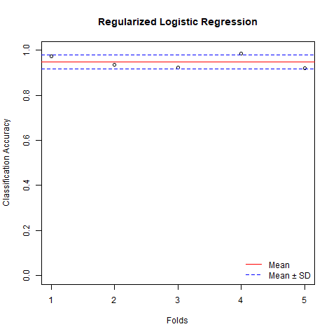
  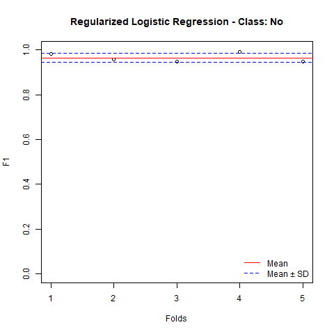
  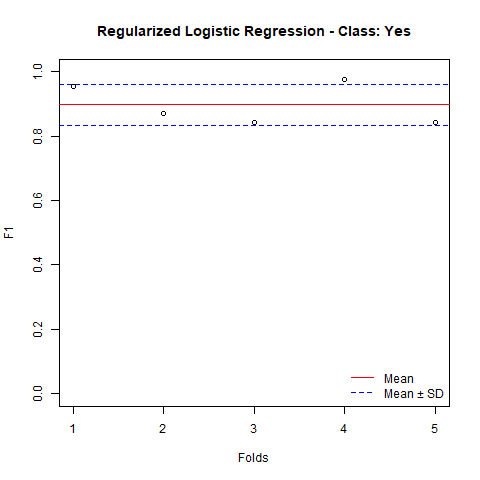
  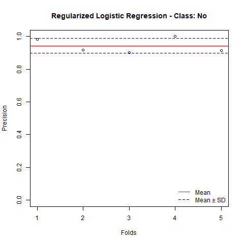
  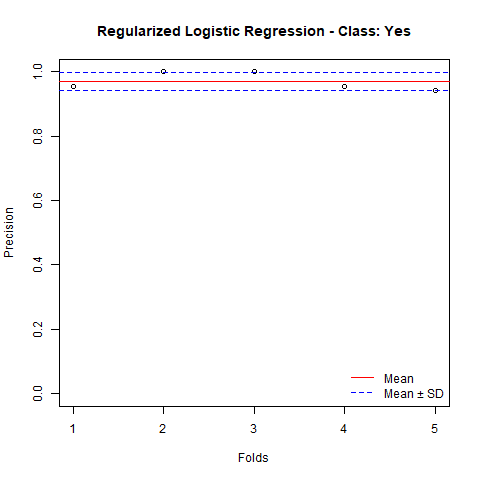
  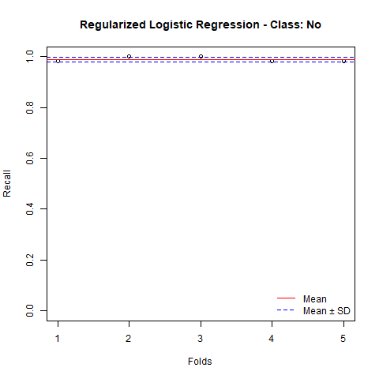
  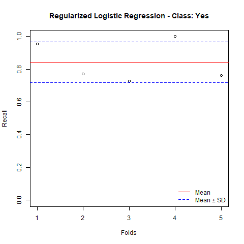
  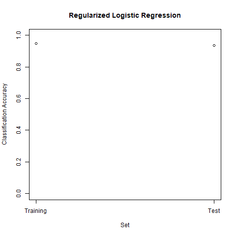
  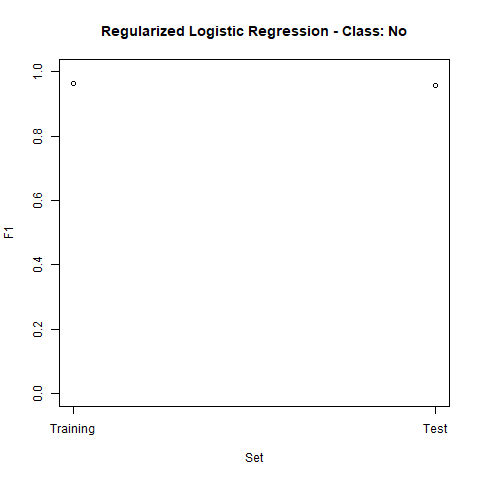
  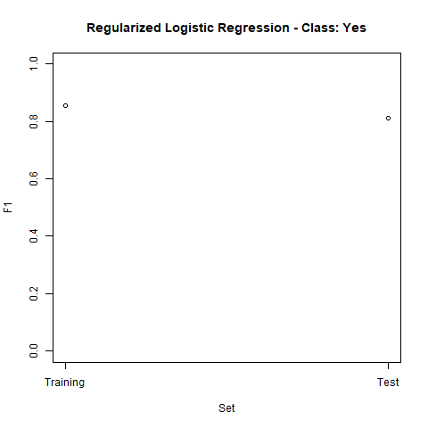
  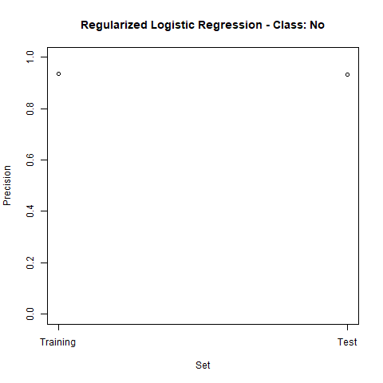
  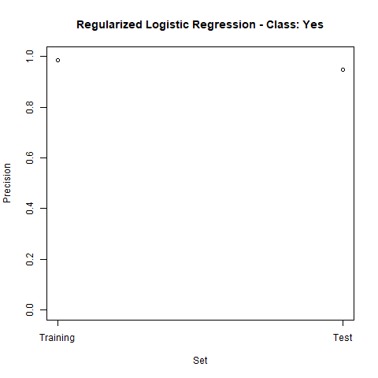
  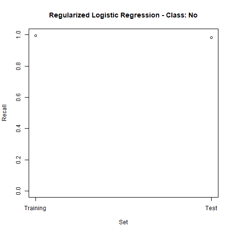
  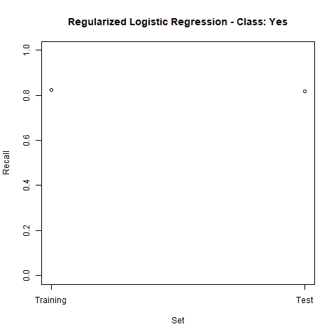

</details>

### Impute Incomplete Labeled Data

```R
set.seed(50)

# Introduce some missing data
for (i in 1:ncol(thyroid_data)) {
  thyroid_data[sample(1:nrow(thyroid_data), size = round(nrow(thyroid_data) * .01)), i] <- NA
}

results <- classCV(
  formula = Recurred ~ .,
  data = thyroid_data,
  models = "randomforest",
  train_params = list(
    split = 0.8,
    n_folds = 5,
    stratified = TRUE,
    random_seed = 50,
    standardize = TRUE
  ),
  impute_params = list(method = "impute_bag", args = list(trees = 20, seed_val = 50)),
  model_params = list(final_model = FALSE),
  save = list(models = FALSE, data = FALSE)
)
                   
print(results)
```
**Output**
```
Warning messages:
1: In .clean_data(data, missing_info, !is.null(impute_params$method)) :
  dropping 4 unlabeled observations
2: In .clean_data(data, missing_info, !is.null(impute_params$method)) :
  61 labeled observations are missing data in one or more features and will be imputed

- - - - - - - - - - - - - - - - - - - - - - - - - - - - - - - - - - - - - - - - 


Model: Random Forest 

Formula: Recurred ~ .

Number of Features: 16

Classes: No, Yes

Training Parameters: list(split = 0.8, n_folds = 5, stratified = TRUE, random_seed = 50, standardize = TRUE, remove_obs = FALSE)

Model Parameters: list(map_args = NULL, final_model = FALSE)

Unlabeled Data: 4

Incomplete Labeled Data: 61

Sample Size (Complete + Imputed Incomplete Labeled Data): 379

Imputation Parameters: list(method = "impute_bag", args = list(trees = 20, seed_val = 50))

Parallel Configs: list(n_cores = NULL, future.seed = NULL)


 Training 
_ _ _ _ _ _ _ _ _ _ _ _ _ _ _ _ _ _ _ _ _ 

Classification Accuracy:  1.00 

Class:   Precision:  Recall:       F1:

No             1.00     1.00      1.00 
Yes            1.00     0.99      0.99 


 Test 
_ _ _ _ _ _ _ _ _ _ _ _ _ _ _ _ _ _ _ _ _ 

Classification Accuracy:  0.94 

Class:   Precision:  Recall:       F1:

No             0.95     0.96      0.95 
Yes            0.90     0.86      0.88 


 Cross-validation (CV) 
_ _ _ _ _ _ _ _ _ _ _ _ _ _ _ _ _ _ _ _ _ 

Average Classification Accuracy:  0.97 ± 0.01 (SD) 

Class:       Average Precision:        Average Recall:            Average F1:

No             0.96 ± 0.01 (SD)       0.99 ± 0.02 (SD)       0.98 ± 0.01 (SD) 
Yes            0.97 ± 0.04 (SD)       0.91 ± 0.03 (SD)       0.94 ± 0.02 (SD) 

- - - - - - - - - - - - - - - - - - - - - - - - - - - - - - - - - - - - - - - - 
```

Displaying what is contained in the vswift object by converting its class to a list and using R's base `print` function.

```R
class(results) <- "list"
print(results)
```

<details>
    <summary>Output</summary>

    ```
    $configs
    $configs$formula
    Recurred ~ .
    
    $configs$n_features
    [1] 16
    
    $configs$models
    [1] "randomforest"
    
    $configs$model_params
    $configs$model_params$final_model
    [1] FALSE
    
    $configs$model_params$map_args
    NULL
    
    $configs$model_params$logistic_threshold
    NULL
    
    
    $configs$train_params
    $configs$train_params$split
    [1] 0.8
    
    $configs$train_params$n_folds
    [1] 5
    
    $configs$train_params$stratified
    [1] TRUE
    
    $configs$train_params$random_seed
    [1] 50
    
    $configs$train_params$standardize
    [1] TRUE
    
    $configs$train_params$remove_obs
    [1] FALSE
    
    
    $configs$impute_params
    $configs$impute_params$method
    [1] "impute_bag"
    
    $configs$impute_params$args
    $configs$impute_params$args$trees
    [1] 20
    
    $configs$impute_params$args$seed_val
    [1] 50
    
    
    
    $configs$parallel_configs
    $configs$parallel_configs$n_cores
    NULL
    
    $configs$parallel_configs$future.seed
    NULL
    
    
    $configs$save
    $configs$save$models
    [1] FALSE
    
    $configs$save$data
    [1] FALSE
    
    
    
    $missing_data_summary
    $missing_data_summary$unlabeled_data
    [1] 4
    
    $missing_data_summary$incomplete_labeled_data
    [1] 61
    
    $missing_data_summary$complete_data
    [1] 318
    
    
    $class_summary
    $class_summary$classes
    [1] "No"  "Yes"
    
    $class_summary$proportions
    target_vector
           No       Yes 
    0.7176781 0.2823219 
    
    $class_summary$indices
    $class_summary$indices$No
      [1]   1   2   3   4   5   6   7   8   9  10  11  12  13  14  15  16  17  18  19  20  21  22  23  24  25  26  27  28  29  30  31  32  33
     [34]  34  35  36  37  38  39  40  41  42  43  44  45  46  47  49  50  51  52  53  54  55  56  57  58  59  60  61  62  63  64  65  66  67
     [67]  68  69  70  71  72  73  74  75  76  77  78  79  80  81  82  83  84  85  86  92  93  94  95  96  97  98  99 100 101 102 103 104 105
    [100] 106 107 108 109 110 111 112 113 114 115 116 117 118 119 120 121 122 123 124 125 126 127 128 129 130 131 132 133 134 135 136 137 138
    [133] 139 140 141 142 143 144 145 146 147 148 149 150 151 152 153 154 155 156 157 158 159 160 161 162 163 164 165 166 167 168 169 170 171
    [166] 172 173 174 175 176 177 178 179 180 181 182 183 184 185 186 187 188 189 190 191 192 193 194 195 196 197 198 199 200 201 202 203 204
    [199] 205 206 207 208 209 210 211 212 213 214 215 216 217 218 219 220 241 242 243 244 245 246 247 248 249 250 251 252 253 254 255 256 257
    [232] 258 259 260 261 262 263 264 265 266 267 268 269 270 271 272 273 274 275 276 277 278 279 280 281 282 283 284 285 286 287 288 289 290
    [265] 291 292 293 294 295 337 338 352
    
    $class_summary$indices$Yes
      [1]  48  87  88  89  90  91 221 222 223 224 225 226 227 228 229 230 231 232 233 234 235 236 237 238 239 240 296 297 298 299 300 301 302
     [34] 303 304 305 306 307 308 309 310 311 312 313 314 315 316 317 318 319 320 321 322 323 324 325 326 327 328 329 330 331 332 333 334 335
     [67] 336 339 340 341 342 343 344 345 346 347 348 349 350 351 353 354 355 356 357 358 359 360 361 362 363 364 365 366 367 368 369 370 371
    [100] 372 373 374 375 376 377 378 379
    
    
    
    $data_partitions
    $data_partitions$indices
    $data_partitions$indices$split
    $data_partitions$indices$split$train
      [1]  11 101 201  18 279 276 119  58 166  13 104 243 168 277   7  83  69  93  71 173 206   6 255 174 187 214   4  26 151 264  61  51 256
     [34] 135 258  16 216 149 197 186 217  81 352 154 338 242  38  43 111  57 107 132 280 192  78   2  70  44 157 121  92 191 164 241 136  15
     [67] 257 160  96  32 105 141 142 285 265 288  53 137 139  94 126  41 286  65  97 106 266 287  19  30 162  31 167  80 100  56  24 199 134
    [100] 113  95 281 267  10 190 120  66 102 245 158 146 175 209 130 253 138   3 188 124 143 145  17 290 271 127 185 109 177 112 179 207 131
    [133] 294  73 259 152 275 208 210  47 268 212 183 293 181 272 195 200  63 269  12  54  74 278 260   1  60 156  49 205  67 213  33  85 128
    [166]  28 155   9  64 171 284  35   5 292  76   8  34  29 291 270  14  20  79 115 123 125  46 170 117  42 129 198 110 159 196  82 219 153
    [199] 163  98 172  40 116 215 204 148  45  59 261  62 295 220 147  52 244 161 180 305  90 221 227 340 350 344 375 367 234 328 362  48 374
    [232] 336 317 370 314 373 303 233 230  88 355 357 353 327 371 315 356 341 229 307  87 236 223 342 222 349 366 318 239 238 331 330 322 364
    [265] 323 310 339 321 343 313 320 358 335 301 237 309  89 296 297 319 347 365 306 351 332 376 346 361 235 228 311 298 378 334 359 360 326
    [298] 325 312 369 308 224 179 121
    
    $data_partitions$indices$split$test
     [1] 103  50 193  77 182 262  22 211  36 194 108  39 251  25 118  23  84  37 246 144 274 178 250 150  99 189 203 248  68  27 289 165 249 202
    [35] 114 184  72 273 252 133 263 337 122 176 247  21  75  55 140 254 169 283 218  86 324 299 345 368 231 240 379 316  91 304 225 363 377 372
    [69] 300 354 232 302 348 329 333 282 226
    
    
    $data_partitions$indices$cv
    $data_partitions$indices$cv$fold1
     [1] 232 210  50  11 101 201  18 279 276 119  58 166  13 104 243 168 277   7  83  69  93  71 173 206   6 255 174 187 214   4  26 151 264  61
    [35]  51 256 135 258  16 216 149 197 186 217  81 352 154 338 242  38  43 111  57 107 132 280 327 348  87 340 313 237 358 326 299 356 375 377
    [69] 359 229 351 240 362 301 221 222  91
    
    $data_partitions$indices$cv$fold2
     [1] 341 215  76 164 128  67 167 284 170 117 155 268  53 205 267  82 121 130  17   2  27  39 198  40 250 204 106 124  72  32 251 290 163 139
    [35] 118 116  65  15 275 146  84 126 281 193 179 254  41 159  94 169   3 219 152 176 178  24 307 310 336 304 374 357 350 370 302 225 363 354
    [69] 309 233 228 239 346 373 366 372 328
    
    $data_partitions$indices$cv$fold3
     [1] 156 103 138 273  97 208   9  78 108   5  23 127 269   1  12 262  56 259  49  46  20 162 248  10 247 184 131  19  99  28 136 220  34  29
    [35] 150 287  59  79 285 141 295 143  55 244 337 253 112 125  68 213 294 180 183  75 353 224 339 365 316 298 297 342 347 236  89  48 368 230
    [69] 322 361 319 343  88 329 378
    
    $data_partitions$indices$cv$fold4
     [1] 172 265 207  33 145 153  60 123 147  22  63  21 199 120  31 272 114 218  86  85 115 189 241  52 291 177 181 192 182  35 212 140 113  73
    [35]  66  80 266  54  77 270 188 203 286 144 134 160  74 158 109 271  64  96 100  25 234 305 231 308 238 371 334 317 349 325  90 369 226 311
    [69] 355 376 367 223 315 360 318
    
    $data_partitions$indices$cv$fold5
     [1] 194  30 110 293 252 278 171 137 191 185 102 175   8 246 289  42 200  95 196  14 209 133  47  44  45 165 249  62 148 202 288 263 142 129
    [35]  98 260 245  92 122 282  70 292 157 195  36 261 190 161 283 274 211 257 105  37 227 296 324 331 321 303 330 332 335 323 344 320 300 312
    [69] 235 345 379 306 364 314 333
    
    
    
    $data_partitions$proportions
    $data_partitions$proportions$split
    $data_partitions$proportions$split$train
    
           No       Yes 
    0.7203947 0.2796053 
    
    $data_partitions$proportions$split$test
    
           No       Yes 
    0.7142857 0.2857143 
    
    
    $data_partitions$proportions$cv
    $data_partitions$proportions$cv$fold1
    
           No       Yes 
    0.7142857 0.2857143 
    
    $data_partitions$proportions$cv$fold2
    
           No       Yes 
    0.7142857 0.2857143 
    
    $data_partitions$proportions$cv$fold3
    
      No  Yes 
    0.72 0.28 
    
    $data_partitions$proportions$cv$fold4
    
      No  Yes 
    0.72 0.28 
    
    $data_partitions$proportions$cv$fold5
    
      No  Yes 
    0.72 0.28 
    
    
    
    
    $metrics
    $metrics$randomforest
    $metrics$randomforest$split
           Set Classification Accuracy Class: No Precision Class: No Recall Class: No F1 Class: Yes Precision Class: Yes Recall Class: Yes F1
    1 Training               0.9967105           0.9954545        1.0000000    0.9977221            1.0000000         0.9882353     0.9940828
    2     Test               0.9350649           0.9464286        0.9636364    0.9549550            0.9047619         0.8636364     0.8837209
    
    $metrics$randomforest$cv
                        Fold Classification Accuracy Class: No Precision Class: No Recall Class: No F1 Class: Yes Precision Class: Yes Recall
    1                 Fold 1             0.961038961         0.948275862      1.000000000  0.973451327           1.00000000        0.86363636
    2                 Fold 2             0.974025974         0.964912281      1.000000000  0.982142857           1.00000000        0.90909091
    3                 Fold 3             0.973333333         0.981481481      0.981481481  0.981481481           0.95238095        0.95238095
    4                 Fold 4             0.973333333         0.964285714      1.000000000  0.981818182           1.00000000        0.90476190
    5                 Fold 5             0.946666667         0.962962963      0.962962963  0.962962963           0.90476190        0.90476190
    6               Mean CV:             0.965679654         0.964383660      0.988888889  0.976371362           0.97142857        0.90692641
    7 Standard Deviation CV:             0.011935749         0.011769708      0.016563466  0.008327711           0.04259177        0.03144121
    8     Standard Error CV:             0.005337829         0.005263573      0.007407407  0.003724266           0.01904762        0.01406094
      Class: Yes F1
    1   0.926829268
    2   0.952380952
    3   0.952380952
    4   0.950000000
    5   0.904761905
    6   0.937270616
    7   0.021121788
    8   0.009445951
    ```
</details>

### Using Parallel Processing

Parallel processing operates at the fold level, which means the system can simultaneously process multiple cross-validation folds (and the train-test split) even when training a single model.

*Note*: This example uses the [Internet Advertisements data from the UCI Machine Learning Repository](https://archive.ics.uci.edu/dataset/51/internet+advertisements).

```R
set.seed(NULL)

# Set url for Internet Advertisements data from UCI Machine Learning Repository. This data has 3,278 instances and 1558 features.
url <- "https://archive.ics.uci.edu/static/public/51/internet+advertisements.zip"

# Set file destination
dest_file <- file.path(getwd(), "ad.zip")

# Download zip file
download.file(url, dest_file)

# Unzip file
unzip(zipfile = dest_file, files = "ad.data")

# Read data
ad_data <- read.csv("ad.data")

# Load in vswift
library(vswift)

# Create arguments variable to tune parameters for multiple models
map_args <- list(
  "knn" = list(ks = 5),
  "xgboost" = list(
    params = list(
      booster = "gbtree",
      objective = "reg:logistic",
      lambda = 0.0003,
      alpha = 0.0003,
      eta = 0.8,
      max_depth = 6
    ),
    nrounds = 10
  )
)

print("Without Parallel Processing:")

# Obtain new start time
start <- proc.time()

# Run the same model without parallel processing
results <- classCV(
  data = ad_data,
  target = "ad.",
  models = c("knn", "svm", "decisiontree", "xgboost"),
  train_params = list(
    split = 0.8,
    n_folds = 5,
    random_seed = 50
  ),
  model_params = list(map_args = map_args)
)

# Get end time
end <- proc.time() - start

# Print time
print(end)

print("Parallel Processing:")

# Adjust maximum object size that can be passed to workers during parallel processing; ~1.2 gb
options(future.globals.maxSize = 1200 * 1024^2)

# Obtain start time
start_par <- proc.time()

# Run model using parallel processing with 4 cores
results <- classCV(
  data = ad_data,
  target = "ad.",
  models = c("knn", "svm", "decisiontree", "xgboost"),
  train_params = list(
    split = 0.8,
    n_folds = 5,
    random_seed = 50
  ),
  model_params = list(map_args = map_args),
  parallel_configs = list(
    n_cores = 6,
    future.seed = 100
  )
)

# Obtain end time
end_par <- proc.time() - start_par

# Print time
print(end_par)
```

**Output:**
```
[1] "Without Parallel Processing:"

Warning message:
In .create_dictionary(preprocessed_data[, vars$target]) :
  creating keys for target variable due to 'logistic' or 'xgboost' being specified;
  classes are now encoded: ad. = 0, nonad. = 1

   user  system elapsed 
 227.53    4.24  214.43

[1] "Parallel Processing:"

Warning message:
In .create_dictionary(preprocessed_data[, vars$target]) :
  creating keys for target variable due to 'logistic' or 'xgboost' being specified;
  classes are now encoded: ad. = 0, nonad. = 1

   user  system elapsed 
   1.64    4.67   96.27
```

```R
# Print parameter information and model evaluation metrics; If number of features > 20, the target replaces the formula
print(results, models = c("xgboost", "knn"))
```

**Output:**
```
- - - - - - - - - - - - - - - - - - - - - - - - - - - - - - - - - - - - - - - - - - 


Model: Extreme Gradient Boosting 

Target: ad.

Number of Features: 1558

Classes: ad., nonad.

Training Parameters: list(split = 0.8, n_folds = 5, random_seed = 50, stratified = FALSE, standardize = FALSE, remove_obs = FALSE)

Model Parameters: list(map_args = list(xgboost = list(params = list(booster = "gbtree", objective = "reg:logistic", lambda = 3e-04, alpha = 3e-04, eta = 0.8, max_depth = 6), nrounds = 10)), logistic_threshold = 0.5, final_model = FALSE)

Unlabeled Data: 0

Incomplete Labeled Data: 0

Sample Size (Complete Data): 3278

Imputation Parameters: list(method = NULL, args = NULL)

Parallel Configs: list(n_cores = 6, future.seed = 100)


 Training 
_ _ _ _ _ _ _ _ _ _ _ _ _ _ _ _ _ _ _ _ _ 

Classification Accuracy:  0.99 

Class:      Precision:  Recall:       F1:

ad.               0.99     0.93      0.96 
nonad.            0.99     1.00      0.99 


 Test 
_ _ _ _ _ _ _ _ _ _ _ _ _ _ _ _ _ _ _ _ _ 

Classification Accuracy:  0.98 

Class:      Precision:  Recall:       F1:

ad.               0.97     0.89      0.93 
nonad.            0.98     0.99      0.99 


 Cross-validation (CV) 
_ _ _ _ _ _ _ _ _ _ _ _ _ _ _ _ _ _ _ _ _ 

Average Classification Accuracy:  0.98 ± 0.01 (SD) 

Class:          Average Precision:        Average Recall:            Average F1:

ad.               0.95 ± 0.02 (SD)       0.88 ± 0.04 (SD)       0.91 ± 0.03 (SD) 
nonad.            0.98 ± 0.01 (SD)       0.99 ± 0.00 (SD)       0.99 ± 0.00 (SD) 

- - - - - - - - - - - - - - - - - - - - - - - - - - - - - - - - - - - - - - - - - - 


Model: K-Nearest Neighbors 

Target: ad.

Number of Features: 1558

Classes: ad., nonad.

Training Parameters: list(split = 0.8, n_folds = 5, random_seed = 50, stratified = FALSE, standardize = FALSE, remove_obs = FALSE)

Model Parameters: list(map_args = list(knn = list(ks = 5)), logistic_threshold = 0.5, final_model = FALSE)

Unlabeled Data: 0

Incomplete Labeled Data: 0

Sample Size (Complete Data): 3278

Imputation Parameters: list(method = NULL, args = NULL)

Parallel Configs: list(n_cores = 6, future.seed = 100)


 Training 
_ _ _ _ _ _ _ _ _ _ _ _ _ _ _ _ _ _ _ _ _ 

Classification Accuracy:  1.00 

Class:      Precision:  Recall:       F1:

ad.               1.00     0.99      1.00 
nonad.            1.00     1.00      1.00 


 Test 
_ _ _ _ _ _ _ _ _ _ _ _ _ _ _ _ _ _ _ _ _ 

Classification Accuracy:  0.96 

Class:      Precision:  Recall:       F1:

ad.               0.89     0.80      0.84 
nonad.            0.97     0.98      0.98 


 Cross-validation (CV) 
_ _ _ _ _ _ _ _ _ _ _ _ _ _ _ _ _ _ _ _ _ 

Average Classification Accuracy:  0.93 ± 0.01 (SD) 

Class:          Average Precision:        Average Recall:            Average F1:

ad.               0.71 ± 0.07 (SD)       0.82 ± 0.01 (SD)       0.76 ± 0.04 (SD) 
nonad.            0.97 ± 0.00 (SD)       0.95 ± 0.02 (SD)       0.96 ± 0.01 (SD) 

- - - - - - - - - - - - - - - - - - - - - - - - - - - - - - - - - - - - - - - - - - 
```

```R
# Plot results
plot(
  results,
  models = "xgboost",
  class_names = "ad.",
  metrics = c("precision", "recall"),
  path = getwd()
)
```

<details>
  
  <summary>Plots</summary>

  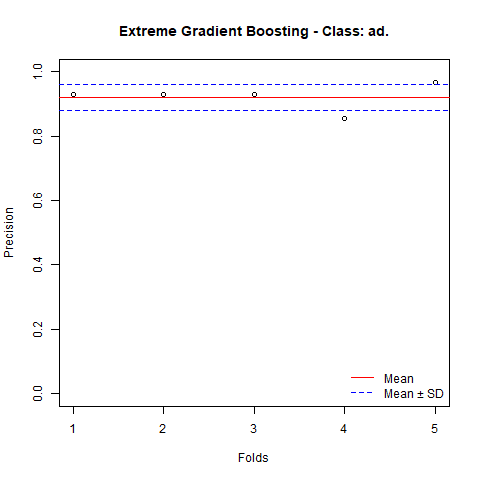
  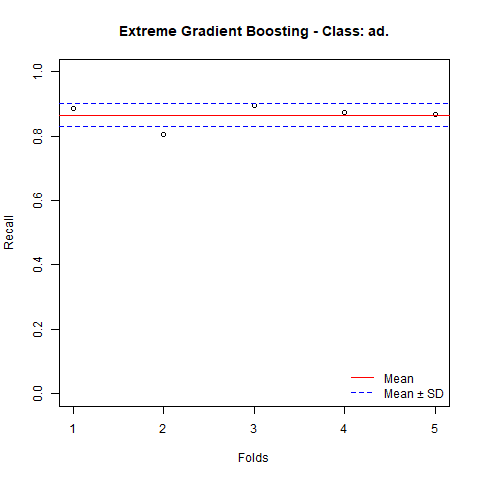
  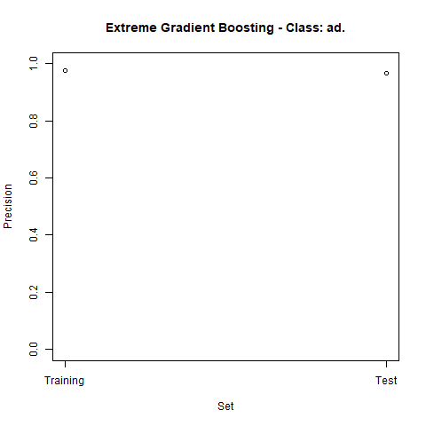
  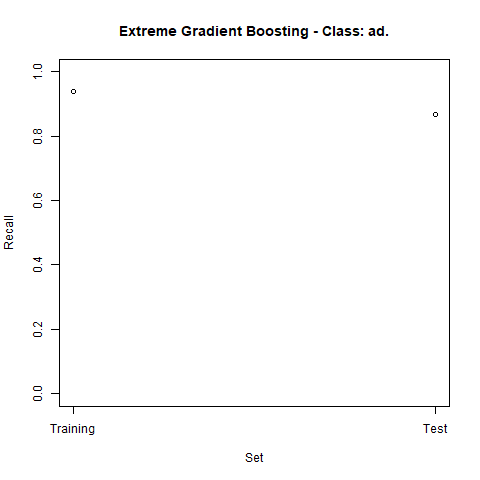

</details>

## Acknowledgements
This package was initially inspired by topepo's [caret](https://github.com/topepo/caret) package.
