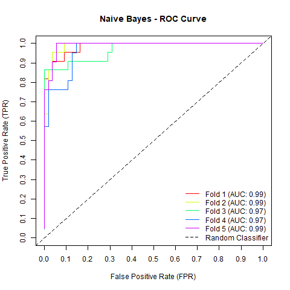
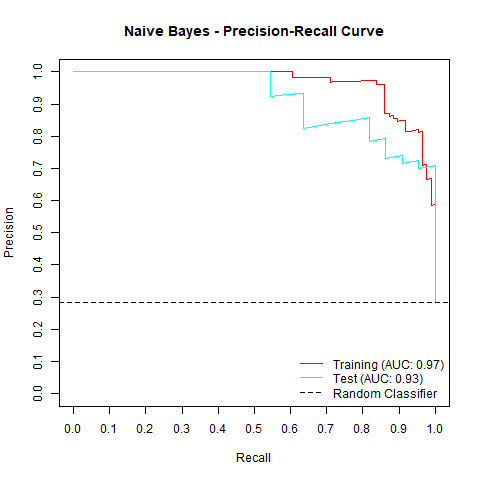
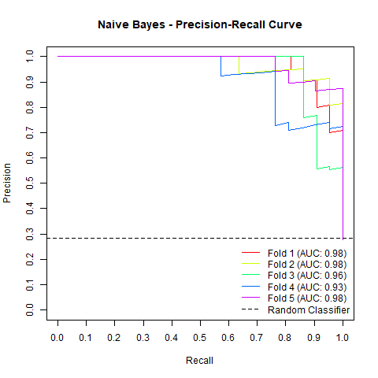

# vswift

[](https://github.com/donishadsmith/vswift/actions/workflows/testing.yaml)
[](https://codecov.io/github/donishadsmith/vswift)
[](https://opensource.org/licenses/MIT)

vswift provides a unified interface to multiple classification algorithms from popular R packages for performing model evaluation on classification tasks (binary and multi-class).

## Supported Classification Algorithms
The following classification algorithms are available through their respective R packages:

  - `lda` from MASS package for Linear Discriminant Analysis
  - `qda` from MASS package for Quadratic Discriminant Analysis
  - `glm` from base package with `family = "binomial"` for Unregularized Logistic Regression
  - `glmnet` from `glmnet` package with `family = "binomial"` or `family = "multinomial"`and using `cv.glmnet` to select the optimal lambda for
  Regularized Logistic Regression and Regularized Multinomial Logistic Regression.
  - `svm` from e1071 package for Support Vector Machine
  - `naive_bayes` from naivebayes package for Naive Bayes
  - `nnet` from nnet package for Neural Network
  - `train.kknn` from kknn package for K-Nearest Neighbors
  - `rpart` from rpart package for Decision Trees
  - `randomForest` from randomForest package for Random Forest
  - `multinom` from nnet package for Unregularized Multinomial Logistic Regression
  - `xgb.train` from xgboost package for Extreme Gradient Boosting

## Features

### Data Handling
- **Versatile Data Splitting**: Perform train-test splits or cross-validation on your classification data.
- **Stratified Sampling Option**: Ensure representative class distribution using stratified sampling based on class proportions.
- **Handling Unseen Categorical Levels**: Automatically exclude observations from the validation/test set with categories not seen during model training.

### Model Configuration
- **Support for Popular Algorithms**: Choose from a wide range of classification algorithms. Multiple algorithms can be specified in a single function call.
- **Model Saving Capabilities**: Save all models utilized for training and testing for both train-test splitting and cross-validation.
- **Final Model Creation**: Easily create and save final models for future use.
- **Dataset Saving Options**: Preserve split datasets and folds for reproducibility.
- **Parallel Processing**: Utilize multi-core processing for cross-validation through the future package, configurable via `n_cores` and `future.seed` keys in the `parallel_configs` parameter.

### Data Preprocessing
- **Missing Data Imputation**: Select either Bagged Tree Imputation or KNN Imputation, implemented using the recipes package. Imputation only uses feature data (specifically observations where not all features are missing) from the training set to prevent leakage.
- **Automatic Numerical Encoding**: Target variable classes are automatically encoded numerically for algorithms requiring numerical inputs.

### Model Evaluation
- **Comprehensive Metrics**: Generate and save performance metrics including classification accuracy, precision, recall, and F1 for each class. For binary classification tasks, produce ROC (Receiver Operating Characteristic) and PR (Precision-Recall) curves and calculate AUC (Area Under Curve) scores.

## Installation

### From the "main" branch

```R
# Install 'devtools' to install packages from Github
install.packages("devtools")

# Install 'vswift' package
devtools::install_github("donishadsmith/vswift", build_manual = TRUE, build_vignettes = TRUE)
 
# Display documentation for the 'vswift' package
help(package = "vswift")
```

### Github release

```R
# Install 'vswift' package
install.packages(
  "https://github.com/donishadsmith/vswift/releases/download/0.5.0.9006/vswift_0.5.0.9006.tar.gz",
  repos = NULL,
  type = "source"
)

# Display documentation for the 'vswift' package
help(package = "vswift")
```
## Usage

The type of classification algorithm is specified using the `models` parameter in the `classCV` function.

Acceptable inputs for the `models` parameter includes:

  - "lda" for Linear Discriminant Analysis
  - "qda" for Quadratic Discriminant Analysis
  - "logistic" for Unregularized Logistic Regression
  - "regularized_logistic" for Regularized Logistic Regression
  - "svm" for Support Vector Machine
  - "naivebayes" for Naive Bayes
  - "nnet" for Neural Network 
  - "knn" for K-Nearest Neighbors
  - "decisiontree" for Decision Trees
  - "randomforest" for Random Forest
  - "multinom" for Unregularized Multinomial Logistic Regression
  - "regularized_multinomial" for Regularized Multinomial Logistic Regression
  - "xgboost" for Extreme Gradient Boosting

### Using a single model

*Note*: This example uses the [Differentiated Thyroid Cancer Recurrence data from the UCI Machine Learning Repository](https://archive.ics.uci.edu/dataset/915/differentiated+thyroid+cancer+recurrence). Additionally,
if stratification is requested and one of the regularized models is used, then stratification will also be performed
on the training data used for `cv.glmnet`. In this case, the `foldid` parameter in `cv.glmnet` will be used to retain
the relative proportions in the target variable.

```R
# Set url for Thyroid Recurrence data from UCI Machine Learning Repository. This data has 383 instances and 16 features
url <- "https://archive.ics.uci.edu/static/public/915/differentiated+thyroid+cancer+recurrence.zip"

# Set file destination
dest_file <- file.path(getwd(), "thyroid.zip")

# Download zip file
download.file(url, dest_file)

# Unzip file
unzip(zipfile = dest_file, files = "Thyroid_Diff.csv")

thyroid_data <- read.csv("Thyroid_Diff.csv")

# Load the package
library(vswift)

# Model arguments; nfolds is the number of folds for `cv.glmnet`
map_args <- list(regularized_logistic = list(alpha = 1, nfolds = 3))

# Perform train-test split and cross-validation with stratified sampling
results <- classCV(
  data = thyroid_data,
  formula = Recurred ~ .,
  models = "regularized_logistic",
  model_params = list(
  map_args = map_args,
  rule = "1se", # rule can be "min" or "1se"
  verbose = TRUE
  ),
  train_params = list(
    split = 0.8,
    n_folds = 5,
    standardize = TRUE,
    stratified = TRUE,
    random_seed = 123
  ),
  save = list(models = TRUE) # Saves both `cv.glmnet` and `glmnet` model
)
```

<details>

<summary><strong>Output Message</strong></summary>

```
Model: regularized_logistic | Partition: Train-Test Split | Optimal lambda: 0.09459 (nested 3-fold cross-validation using '1se' rule) 
Model: regularized_logistic | Partition: Fold 1 | Optimal lambda: 0.00983 (nested 3-fold cross-validation using '1se' rule) 
Model: regularized_logistic | Partition: Fold 2 | Optimal lambda: 0.07949 (nested 3-fold cross-validation using '1se' rule) 
Model: regularized_logistic | Partition: Fold 3 | Optimal lambda: 0.01376 (nested 3-fold cross-validation using '1se' rule) 
Model: regularized_logistic | Partition: Fold 4 | Optimal lambda: 0.00565 (nested 3-fold cross-validation using '1se' rule) 
Model: regularized_logistic | Partition: Fold 5 | Optimal lambda: 0.01253 (nested 3-fold cross-validation using '1se' rule)
```

</details>


Print optimal lambda values.
```R
print(results$metrics$regularized_logistic$optimal_lambdas)
```

<details>

<summary><strong>Output</strong></summary>

```
      split       fold1       fold2       fold3       fold4       fold5 
0.094590537 0.009834647 0.079494739 0.013763132 0.005649260 0.012525544 
```

</details>


```R
# Print parameter information and model evaluation metrics
print(results, parameters = TRUE, metrics = TRUE)
```

<details>

<summary><strong>Output</strong></summary>

```
- - - - - - - - - - - - - - - - - - - - - - - - - - - - - - - - - - - - - - - - 


Model: Regularized Logistic Regression 

Formula: Recurred ~ .

Number of Features: 16

Classes: No, Yes

Training Parameters: list(split = 0.8, n_folds = 5, stratified = TRUE, random_seed = 123, standardize = TRUE, remove_obs = FALSE)

Model Parameters: list(map_args = list(regularized_logistic = list(alpha = 1, nfolds = 3)), threshold = NULL, rule = "1se", final_model = FALSE, verbose = TRUE)

Unlabeled Observations: 0

Incomplete Labeled Observations: 0

Observations Missing All Features: 0

Sample Size (Complete Observations): 383

Imputation Parameters: list(method = NULL, args = NULL)

Parallel Configs: list(n_cores = NULL, future.seed = NULL)


Training 
_ _ _ _ _ _ _ _ _ _ _ _ _ _ _ _ _ _ _ _ _ 

Classification Accuracy:  0.93 

Class:   Precision:  Recall:       F1:

No             0.91     1.00      0.95 
Yes            0.98     0.76      0.86 


Test 
_ _ _ _ _ _ _ _ _ _ _ _ _ _ _ _ _ _ _ _ _ 

Classification Accuracy:  0.91 

Class:   Precision:  Recall:       F1:

No             0.89     1.00      0.94 
Yes            1.00     0.68      0.81 


Cross-validation (CV) 
_ _ _ _ _ _ _ _ _ _ _ _ _ _ _ _ _ _ _ _ _ 

Average Classification Accuracy:  0.95 ± 0.03 (SD) 

Class:       Average Precision:        Average Recall:            Average F1:

No             0.94 ± 0.04 (SD)       0.99 ± 0.01 (SD)       0.96 ± 0.02 (SD) 
Yes            0.97 ± 0.03 (SD)       0.84 ± 0.12 (SD)       0.90 ± 0.06 (SD) 

- - - - - - - - - - - - - - - - - - - - - - - - - - - - - - - - - - - - - - - - 
```

</details>

```R
# Plot model evaluation metrics
plot(results, split = TRUE, cv = TRUE, path = getwd())
```

<details>
  
  <summary><strong>Plots</strong></summary>
  
  
  
  
  
  
  
  
  
  
  
  
  
  
  

</details>


### Producing ROC and PR Curves with AUC scores
ROC and PR curves are only available for binary classification tasks. To generate either curve, the models must be
saved.

```R
# Can `target` parameter, which accepts characters and integers instead of `formula`
results <- classCV(
  data = thyroid_data,
  target = "Recurred", # Using 17, the column index of "Recurred" is also valid
  models = "naivebayes",
  train_params = list(
    split = 0.8,
    n_folds = 5,
    standardize = TRUE,
    stratified = TRUE,
    random_seed = 123
  ),
  save = list(models = TRUE)
)
```

Output consists of a list containing thresholds used to generate the ROC, target labels, False Positive Rates (FPR),
True Positive Rates (TPR)/Recall, Area Under The Curve (AUC), and Youden's Index for all training and validation sets
for each model. For the PR curve, the outputs replace the FPR with Precision and Youden's Index with the maximum
F1 score and its associated optimal threshold.

```R
# Will derive thresholds from the probabilities
roc_output <- rocCurve(results, thyroid_data, return_output = TRUE, thresholds = NULL, path = getwd())

pr_output <- prCurve(results, thyroid_data, return_output = TRUE, thresholds = NULL, path = getwd())
```

<details>

<summary><strong>Output</strong></summary>

```
Warning message:
In .create_dictionary(x$class_summary$classes, TRUE) :
  creating keys for target variable for `rocCurve`;
  classes are now encoded: No = 0, Yes = 1
  
Warning message:
In .create_dictionary(x$class_summary$classes, TRUE) :
  creating keys for target variable for `prCurve`;
  classes are now encoded: No = 0, Yes = 1
```






</details>


```R
print(roc_output)
```
<details>
    <summary><strong>Output</strong></summary>
    
    $naivebayes
    $naivebayes$split
    $naivebayes$split$train
    $naivebayes$split$train$thresholds
      [1] 0.000000e+00 3.693169e-12 6.027285e-12 4.073907e-11 4.968343e-11 8.108774e-11 8.381271e-11 9.095559e-11 9.298886e-11 9.346182e-11 1.114830e-10
     [12] 1.422435e-10 1.495389e-10 1.587088e-10 1.749989e-10 1.817692e-10 2.138270e-10 2.230345e-10 2.388617e-10 2.522502e-10 3.014117e-10 3.081804e-10
     [23] 3.520544e-10 4.990782e-10 5.274227e-10 6.636250e-10 1.169893e-09 2.079998e-09 2.664128e-09 2.994029e-09 3.799429e-09 4.480205e-09 8.110897e-09
     [34] 1.160010e-08 1.906848e-08 2.064864e-08 4.727744e-08 4.855115e-08 1.106413e-07 2.729630e-07 3.255273e-07 4.366589e-07 4.367644e-07 4.377311e-07
     [45] 4.491246e-07 4.605240e-07 4.802007e-07 4.941300e-07 7.626642e-07 7.711416e-07 7.982413e-07 1.141365e-06 1.141641e-06 1.144168e-06 1.144997e-06
     [56] 1.150071e-06 1.150071e-06 1.151461e-06 1.159124e-06 1.190156e-06 1.206049e-06 1.209843e-06 1.210205e-06 1.219731e-06 1.233172e-06 1.255177e-06
     [67] 1.285671e-06 1.312232e-06 1.320459e-06 1.327175e-06 1.359847e-06 1.542586e-06 1.589408e-06 1.653207e-06 1.913469e-06 1.938166e-06 1.942925e-06
     [78] 1.952949e-06 1.955310e-06 2.019883e-06 2.048006e-06 2.049502e-06 2.065634e-06 2.145067e-06 2.145594e-06 2.149258e-06 2.183214e-06 2.485015e-06
     [89] 2.756766e-06 3.163302e-06 3.167126e-06 3.188202e-06 3.193598e-06 3.221965e-06 3.317270e-06 3.466089e-06 3.761135e-06 4.180838e-06 4.375333e-06
    [100] 4.394098e-06 5.025238e-06 5.040660e-06 5.510162e-06 5.880527e-06 6.284863e-06 6.601731e-06 8.102284e-06 8.600226e-06 8.819485e-06 8.904729e-06
    [111] 9.205136e-06 9.645657e-06 9.923509e-06 1.026900e-05 1.062422e-05 1.064212e-05 1.176210e-05 1.222003e-05 1.605820e-05 1.624896e-05 1.702907e-05
    [122] 1.706613e-05 1.786223e-05 1.877624e-05 1.982338e-05 1.991122e-05 2.209691e-05 2.484095e-05 2.641378e-05 2.866620e-05 3.027296e-05 3.316481e-05
    [133] 3.320879e-05 5.117616e-05 5.327541e-05 5.394977e-05 5.488148e-05 5.718563e-05 5.983486e-05 6.241298e-05 6.974128e-05 7.051644e-05 8.795213e-05
    [144] 9.358483e-05 1.136694e-04 1.172686e-04 1.183107e-04 1.429573e-04 1.611606e-04 1.939608e-04 2.188150e-04 2.214605e-04 2.607734e-04 2.653517e-04
    [155] 3.571503e-04 3.856822e-04 4.807467e-04 5.274486e-04 5.299381e-04 6.543110e-04 6.621021e-04 6.801931e-04 9.347791e-04 1.140267e-03 1.393163e-03
    [166] 1.450880e-03 1.557559e-03 1.742214e-03 1.869285e-03 1.950507e-03 1.958437e-03 1.962707e-03 2.855645e-03 3.687773e-03 4.079561e-03 5.480979e-03
    [177] 6.199631e-03 7.280673e-03 8.575042e-03 8.980047e-03 1.037477e-02 1.169980e-02 1.650789e-02 1.922552e-02 2.256963e-02 2.507362e-02 2.562613e-02
    [188] 3.231358e-02 3.259402e-02 3.444110e-02 4.256348e-02 6.708378e-02 7.683335e-02 7.999753e-02 9.268128e-02 1.387462e-01 1.442460e-01 2.284205e-01
    [199] 2.674336e-01 2.915627e-01 3.236000e-01 3.998560e-01 4.034738e-01 4.077277e-01 4.332884e-01 4.591731e-01 5.209434e-01 5.455645e-01 6.364075e-01
    [210] 6.773157e-01 7.260277e-01 7.279223e-01 7.307607e-01 7.541637e-01 7.771591e-01 7.878685e-01 7.926057e-01 8.284044e-01 9.219936e-01 9.530463e-01
    [221] 9.549080e-01 9.798928e-01 9.858326e-01 9.878472e-01 9.899242e-01 9.943402e-01 9.979936e-01 9.981558e-01 9.982179e-01 9.983899e-01 9.985805e-01
    [232] 9.991084e-01 9.992326e-01 9.997728e-01 9.997956e-01 9.999074e-01 9.999161e-01 9.999199e-01 9.999397e-01 9.999576e-01 9.999603e-01 9.999753e-01
    [243] 9.999791e-01 9.999804e-01 9.999879e-01 9.999906e-01 9.999933e-01 9.999935e-01 9.999935e-01 9.999940e-01 9.999941e-01 9.999949e-01 9.999979e-01
    [254] 9.999984e-01 9.999986e-01 9.999989e-01 9.999989e-01 9.999993e-01 9.999994e-01 9.999994e-01 9.999997e-01 9.999997e-01 9.999998e-01 9.999998e-01
    [265] 9.999999e-01 9.999999e-01 9.999999e-01 1.000000e+00 1.000000e+00 1.000000e+00 1.000000e+00 1.000000e+00 1.000000e+00 1.000000e+00 1.000000e+00
    [276] 1.000000e+00 1.000000e+00 1.000000e+00 1.000000e+00 1.000000e+00 1.000000e+00 1.000000e+00 1.000000e+00 1.000000e+00 1.000000e+00 1.000000e+00
    [287] 1.000000e+00 1.000000e+00 1.000000e+00 1.000000e+00 1.000000e+00 1.000000e+00 1.000000e+00
    
    $naivebayes$split$train$probs
      [1] 2.994029e-09 3.081804e-10 4.480205e-09 2.145067e-06 1.495389e-10 1.114830e-10 1.422435e-10 9.095559e-11 1.169893e-09 3.520544e-10 2.138270e-10
     [12] 2.079998e-09 2.522502e-10 4.727744e-08 1.587088e-10 1.749989e-10 8.381271e-11 6.636250e-10 3.799429e-09 8.108774e-11 4.073907e-11 9.346182e-11
     [23] 5.274227e-10 4.968343e-11 8.381271e-11 4.990782e-10 1.160010e-08 3.014117e-10 8.110897e-09 9.095559e-11 6.027285e-12 1.422435e-10 1.817692e-10
     [34] 9.298886e-11 2.388617e-10 3.693169e-12 2.230345e-10 6.199631e-03 2.145594e-06 2.664128e-09 2.729630e-07 6.601731e-06 1.219731e-06 7.711416e-07
     [45] 1.062422e-05 7.982413e-07 4.605240e-07 1.982338e-05 4.394098e-06 4.491246e-07 5.488148e-05 2.064864e-08 4.491246e-07 1.312232e-06 1.312232e-06
     [56] 4.941300e-07 5.510162e-06 4.367644e-07 4.377311e-07 4.366589e-07 1.210205e-06 4.802007e-07 4.377311e-07 7.626642e-07 1.064212e-05 1.542586e-06
     [67] 1.906848e-08 1.991122e-05 2.562613e-02 9.923509e-06 5.025238e-06 1.429573e-04 9.878472e-01 3.466089e-06 1.589408e-06 8.600226e-06 1.106413e-07
     [78] 3.316481e-05 2.149258e-06 1.172686e-04 2.049502e-06 1.183107e-04 2.065634e-06 2.019883e-06 3.221965e-06 2.048006e-06 5.394977e-05 4.807467e-04
     [89] 6.284863e-06 2.485015e-06 1.144997e-06 1.702907e-05 1.209843e-06 1.955310e-06 3.856822e-04 1.653207e-06 1.150071e-06 3.221965e-06 1.952949e-06
    [100] 1.150071e-06 5.117616e-05 1.159124e-06 3.571503e-04 8.102284e-06 2.653517e-04 1.938166e-06 1.144997e-06 9.645657e-06 1.320459e-06 1.144997e-06
    [111] 3.221965e-06 3.163302e-06 1.327175e-06 3.761135e-06 5.040660e-06 1.942925e-06 1.144168e-06 7.051644e-05 2.866620e-05 3.167126e-06 3.188202e-06
    [122] 1.359847e-06 6.621021e-04 1.206049e-06 1.190156e-06 8.795213e-05 1.151461e-06 3.317270e-06 1.150071e-06 1.255177e-06 1.159124e-06 2.484095e-05
    [133] 1.026900e-05 1.877624e-05 1.141641e-06 4.375333e-06 1.285671e-06 1.611606e-04 1.233172e-06 2.183214e-06 2.641378e-05 1.136694e-04 3.193598e-06
    [144] 4.180838e-06 5.880527e-06 5.274486e-04 2.209691e-05 2.855645e-03 1.176210e-05 2.756766e-06 1.141365e-06 1.913469e-06 3.761135e-06 1.706613e-05
    [155] 1.786223e-05 5.718563e-05 4.855115e-08 3.255273e-07 1.624896e-05 6.801931e-04 4.079561e-03 2.674336e-01 2.607734e-04 1.650789e-02 7.683335e-02
    [166] 4.034738e-01 5.209434e-01 7.878685e-01 8.904729e-06 1.939608e-04 7.541637e-01 5.299381e-04 1.140267e-03 6.974128e-05 4.077277e-01 1.557559e-03
    [177] 9.549080e-01 8.284044e-01 9.991084e-01 9.999994e-01 9.982179e-01 9.979936e-01 9.943402e-01 9.999906e-01 9.999753e-01 9.999791e-01 6.708378e-02
    [188] 1.387462e-01 9.268128e-02 5.480979e-03 8.819485e-06 6.241298e-05 9.985805e-01 5.327541e-05 1.869285e-03 1.922552e-02 4.256348e-02 3.027296e-05
    [199] 1.442460e-01 3.687773e-03 9.347791e-04 1.958437e-03 1.605820e-05 3.320879e-05 1.169980e-02 8.575042e-03 9.358483e-05 5.983486e-05 9.205136e-06
    [210] 1.742214e-03 2.188150e-04 1.222003e-05 1.450880e-03 1.393163e-03 8.980047e-03 6.543110e-04 3.259402e-02 3.231358e-02 2.915627e-01 2.507362e-02
    [221] 1.950507e-03 2.214605e-04 6.364075e-01 7.279223e-01 9.219936e-01 3.444110e-02 6.773157e-01 7.260277e-01 1.962707e-03 7.771591e-01 7.307607e-01
    [232] 2.284205e-01 7.280673e-03 1.037477e-02 7.999753e-02 4.591731e-01 3.236000e-01 9.999941e-01 9.981558e-01 9.999979e-01 9.798928e-01 9.999935e-01
    [243] 9.997956e-01 9.992326e-01 9.999993e-01 9.999074e-01 9.999989e-01 9.899242e-01 9.999199e-01 9.999161e-01 9.999989e-01 9.999935e-01 9.999940e-01
    [254] 9.999999e-01 9.999984e-01 9.999999e-01 9.999999e-01 9.530463e-01 5.455645e-01 9.983899e-01 3.998560e-01 1.000000e+00 9.999879e-01 9.999986e-01
    [265] 9.999994e-01 9.999397e-01 1.000000e+00 9.999603e-01 4.332884e-01 9.997728e-01 9.999576e-01 9.999933e-01 7.926057e-01 9.999949e-01 1.000000e+00
    [276] 1.000000e+00 1.000000e+00 1.000000e+00 9.999998e-01 9.999804e-01 9.858326e-01 1.000000e+00 1.000000e+00 2.256963e-02 1.000000e+00 9.999998e-01
    [287] 1.000000e+00 1.000000e+00 9.999997e-01 1.000000e+00 1.000000e+00 1.000000e+00 1.000000e+00 1.000000e+00 1.000000e+00 1.000000e+00 1.000000e+00
    [298] 9.999997e-01 1.000000e+00 1.000000e+00 1.000000e+00 1.000000e+00 1.000000e+00 1.000000e+00 1.000000e+00
    
    $naivebayes$split$train$labels
     No  No  No  No  No  No  No  No  No  No  No  No  No  No  No  No  No  No  No  No  No  No  No  No  No  No  No  No  No  No  No  No  No  No  No  No  No  No  No 
      0   0   0   0   0   0   0   0   0   0   0   0   0   0   0   0   0   0   0   0   0   0   0   0   0   0   0   0   0   0   0   0   0   0   0   0   0   0   0 
     No  No  No  No  No  No  No  No  No  No  No  No  No  No  No  No  No  No  No  No  No  No  No  No  No  No  No  No  No  No  No  No Yes Yes  No  No  No  No  No 
      0   0   0   0   0   0   0   0   0   0   0   0   0   0   0   0   0   0   0   0   0   0   0   0   0   0   0   0   0   0   0   0   1   1   0   0   0   0   0 
     No  No  No  No  No  No  No  No  No  No  No  No  No  No  No  No  No  No  No  No  No  No  No  No  No  No  No  No  No  No  No  No  No  No  No  No  No  No  No 
      0   0   0   0   0   0   0   0   0   0   0   0   0   0   0   0   0   0   0   0   0   0   0   0   0   0   0   0   0   0   0   0   0   0   0   0   0   0   0 
     No  No  No  No  No  No  No  No  No  No  No  No  No  No  No  No  No  No  No  No  No  No  No  No  No  No  No  No  No  No  No  No  No  No  No  No  No  No  No 
      0   0   0   0   0   0   0   0   0   0   0   0   0   0   0   0   0   0   0   0   0   0   0   0   0   0   0   0   0   0   0   0   0   0   0   0   0   0   0 
     No  No  No  No  No  No  No  No  No  No  No  No  No  No  No  No  No  No Yes Yes Yes Yes Yes Yes Yes Yes Yes Yes Yes Yes Yes Yes Yes Yes  No  No  No  No  No 
      0   0   0   0   0   0   0   0   0   0   0   0   0   0   0   0   0   0   1   1   1   1   1   1   1   1   1   1   1   1   1   1   1   1   0   0   0   0   0 
     No  No  No  No  No  No  No  No  No  No  No  No  No  No  No  No  No  No  No  No  No  No  No  No  No  No  No  No  No  No  No  No  No  No  No  No  No  No  No 
      0   0   0   0   0   0   0   0   0   0   0   0   0   0   0   0   0   0   0   0   0   0   0   0   0   0   0   0   0   0   0   0   0   0   0   0   0   0   0 
    Yes Yes Yes Yes Yes Yes Yes Yes Yes Yes Yes Yes Yes Yes Yes Yes Yes Yes Yes Yes Yes Yes Yes Yes Yes Yes Yes Yes Yes Yes Yes Yes Yes  No  No Yes Yes Yes Yes 
      1   1   1   1   1   1   1   1   1   1   1   1   1   1   1   1   1   1   1   1   1   1   1   1   1   1   1   1   1   1   1   1   1   0   0   1   1   1   1 
    Yes Yes Yes Yes Yes Yes Yes Yes Yes Yes  No Yes Yes Yes Yes Yes Yes Yes Yes Yes Yes Yes Yes Yes Yes Yes Yes Yes Yes Yes Yes Yes 
      1   1   1   1   1   1   1   1   1   1   0   1   1   1   1   1   1   1   1   1   1   1   1   1   1   1   1   1   1   1   1   1 
    
    $naivebayes$split$train$metrics
    $naivebayes$split$train$metrics$fpr
      [1] 1.00000000 1.00000000 0.99543379 0.99086758 0.98630137 0.98173516 0.97716895 0.96803653 0.95890411 0.95433790 0.94977169 0.94520548 0.93607306
     [14] 0.93150685 0.92694064 0.92237443 0.91780822 0.91324201 0.90867580 0.90410959 0.89954338 0.89497717 0.89041096 0.88584475 0.88127854 0.87671233
     [27] 0.87214612 0.86757991 0.86301370 0.85844749 0.85388128 0.84931507 0.84474886 0.84018265 0.83561644 0.83105023 0.82648402 0.82191781 0.81735160
     [40] 0.81278539 0.80821918 0.80365297 0.79908676 0.79452055 0.78538813 0.77625571 0.77168950 0.76712329 0.76255708 0.75799087 0.75342466 0.74885845
     [53] 0.74429224 0.73972603 0.73515982 0.72146119 0.71232877 0.70776256 0.70319635 0.69406393 0.68949772 0.68493151 0.68036530 0.67579909 0.67123288
     [66] 0.66666667 0.66210046 0.65753425 0.64840183 0.64383562 0.63926941 0.63470320 0.63013699 0.62557078 0.62100457 0.61643836 0.61187215 0.60730594
     [79] 0.60273973 0.59817352 0.59360731 0.58904110 0.58447489 0.57990868 0.57534247 0.57077626 0.56621005 0.56164384 0.55707763 0.55251142 0.54794521
     [92] 0.54337900 0.53881279 0.53424658 0.52054795 0.51598174 0.51141553 0.50228311 0.49771689 0.49315068 0.48858447 0.48401826 0.47945205 0.47488584
    [105] 0.47031963 0.46575342 0.46118721 0.45662100 0.45205479 0.44748858 0.44292237 0.43835616 0.43378995 0.42922374 0.42465753 0.42009132 0.41552511
    [118] 0.41095890 0.40639269 0.40182648 0.39726027 0.39269406 0.38812785 0.38356164 0.37899543 0.37442922 0.36986301 0.36529680 0.36073059 0.35616438
    [131] 0.35159817 0.34703196 0.34246575 0.33789954 0.33333333 0.32876712 0.32420091 0.31963470 0.31506849 0.31050228 0.30593607 0.30136986 0.29680365
    [144] 0.29223744 0.28767123 0.28310502 0.27853881 0.27397260 0.27397260 0.26940639 0.26484018 0.26027397 0.25570776 0.25114155 0.24657534 0.24200913
    [157] 0.23744292 0.23287671 0.22831050 0.22374429 0.21917808 0.21461187 0.21004566 0.20547945 0.20091324 0.19634703 0.19178082 0.19178082 0.18721461
    [170] 0.18264840 0.17808219 0.17351598 0.16894977 0.16438356 0.15981735 0.15525114 0.15525114 0.15068493 0.14611872 0.14155251 0.13698630 0.13242009
    [183] 0.12785388 0.12328767 0.11872146 0.11415525 0.10958904 0.10502283 0.10045662 0.09589041 0.09132420 0.08675799 0.08675799 0.08219178 0.08219178
    [196] 0.08219178 0.08219178 0.07762557 0.07305936 0.06849315 0.06392694 0.06392694 0.06392694 0.05936073 0.05936073 0.05479452 0.05479452 0.05022831
    [209] 0.05022831 0.04566210 0.04109589 0.03652968 0.03196347 0.02739726 0.02283105 0.01826484 0.01369863 0.01369863 0.01369863 0.00913242 0.00913242
    [222] 0.00913242 0.00913242 0.00913242 0.00913242 0.00913242 0.00913242 0.00913242 0.00913242 0.00913242 0.00913242 0.00456621 0.00456621 0.00456621
    [235] 0.00456621 0.00456621 0.00456621 0.00456621 0.00456621 0.00456621 0.00456621 0.00000000 0.00000000 0.00000000 0.00000000 0.00000000 0.00000000
    [248] 0.00000000 0.00000000 0.00000000 0.00000000 0.00000000 0.00000000 0.00000000 0.00000000 0.00000000 0.00000000 0.00000000 0.00000000 0.00000000
    [261] 0.00000000 0.00000000 0.00000000 0.00000000 0.00000000 0.00000000 0.00000000 0.00000000 0.00000000 0.00000000 0.00000000 0.00000000 0.00000000
    [274] 0.00000000 0.00000000 0.00000000 0.00000000 0.00000000 0.00000000 0.00000000 0.00000000 0.00000000 0.00000000 0.00000000 0.00000000 0.00000000
    [287] 0.00000000 0.00000000 0.00000000 0.00000000 0.00000000 0.00000000 0.00000000
    
    $naivebayes$split$train$metrics$tpr
      [1] 1.00000000 1.00000000 1.00000000 1.00000000 1.00000000 1.00000000 1.00000000 1.00000000 1.00000000 1.00000000 1.00000000 1.00000000 1.00000000
     [14] 1.00000000 1.00000000 1.00000000 1.00000000 1.00000000 1.00000000 1.00000000 1.00000000 1.00000000 1.00000000 1.00000000 1.00000000 1.00000000
     [27] 1.00000000 1.00000000 1.00000000 1.00000000 1.00000000 1.00000000 1.00000000 1.00000000 1.00000000 1.00000000 1.00000000 1.00000000 1.00000000
     [40] 1.00000000 1.00000000 1.00000000 1.00000000 1.00000000 1.00000000 1.00000000 1.00000000 1.00000000 1.00000000 1.00000000 1.00000000 1.00000000
     [53] 1.00000000 1.00000000 1.00000000 1.00000000 1.00000000 1.00000000 1.00000000 1.00000000 1.00000000 1.00000000 1.00000000 1.00000000 1.00000000
     [66] 1.00000000 1.00000000 1.00000000 1.00000000 1.00000000 1.00000000 1.00000000 1.00000000 1.00000000 1.00000000 1.00000000 1.00000000 1.00000000
     [79] 1.00000000 1.00000000 1.00000000 1.00000000 1.00000000 1.00000000 1.00000000 1.00000000 1.00000000 1.00000000 1.00000000 1.00000000 1.00000000
     [92] 1.00000000 1.00000000 1.00000000 1.00000000 1.00000000 1.00000000 1.00000000 1.00000000 1.00000000 1.00000000 1.00000000 1.00000000 1.00000000
    [105] 1.00000000 1.00000000 1.00000000 1.00000000 1.00000000 1.00000000 1.00000000 1.00000000 1.00000000 1.00000000 1.00000000 1.00000000 1.00000000
    [118] 1.00000000 1.00000000 1.00000000 1.00000000 1.00000000 1.00000000 1.00000000 1.00000000 1.00000000 1.00000000 1.00000000 1.00000000 1.00000000
    [131] 1.00000000 1.00000000 1.00000000 1.00000000 1.00000000 1.00000000 1.00000000 1.00000000 1.00000000 1.00000000 1.00000000 1.00000000 1.00000000
    [144] 1.00000000 1.00000000 1.00000000 1.00000000 1.00000000 0.98837209 0.98837209 0.98837209 0.98837209 0.98837209 0.98837209 0.98837209 0.98837209
    [157] 0.98837209 0.98837209 0.98837209 0.98837209 0.98837209 0.98837209 0.98837209 0.98837209 0.98837209 0.98837209 0.98837209 0.97674419 0.97674419
    [170] 0.97674419 0.97674419 0.97674419 0.97674419 0.97674419 0.97674419 0.97674419 0.96511628 0.96511628 0.96511628 0.96511628 0.96511628 0.96511628
    [183] 0.96511628 0.96511628 0.96511628 0.96511628 0.96511628 0.96511628 0.96511628 0.96511628 0.96511628 0.96511628 0.95348837 0.95348837 0.94186047
    [196] 0.93023256 0.91860465 0.91860465 0.91860465 0.91860465 0.91860465 0.90697674 0.89534884 0.89534884 0.88372093 0.88372093 0.87209302 0.87209302
    [209] 0.86046512 0.86046512 0.86046512 0.86046512 0.86046512 0.86046512 0.86046512 0.86046512 0.86046512 0.84883721 0.83720930 0.83720930 0.82558140
    [222] 0.81395349 0.80232558 0.79069767 0.77906977 0.76744186 0.75581395 0.74418605 0.73255814 0.72093023 0.70930233 0.70930233 0.69767442 0.68604651
    [235] 0.67441860 0.66279070 0.65116279 0.63953488 0.62790698 0.61627907 0.60465116 0.60465116 0.59302326 0.58139535 0.56976744 0.55813953 0.54651163
    [248] 0.53488372 0.52325581 0.51162791 0.50000000 0.48837209 0.47674419 0.46511628 0.45348837 0.44186047 0.43023256 0.41860465 0.40697674 0.39534884
    [261] 0.38372093 0.37209302 0.36046512 0.34883721 0.33720930 0.32558140 0.31395349 0.30232558 0.29069767 0.27906977 0.26744186 0.25581395 0.24418605
    [274] 0.23255814 0.22093023 0.20930233 0.19767442 0.18604651 0.17441860 0.16279070 0.15116279 0.13953488 0.12790698 0.11627907 0.10465116 0.09302326
    [287] 0.08139535 0.06976744 0.05813953 0.04651163 0.03488372 0.02325581 0.01162791
    
    
    $naivebayes$split$train$auc
    [1] 0.984443
    
    $naivebayes$split$train$youdens_indx
    [1] 0.06708378
    
    
    $naivebayes$split$test
    $naivebayes$split$test$thresholds
     [1] 0.000000e+00 3.419046e-12 8.037675e-11 1.446776e-10 2.736345e-10 4.103528e-10 6.237191e-10 7.855963e-10 1.320994e-09 6.122650e-09 8.910814e-09
    [12] 1.885894e-08 1.141641e-06 1.171399e-06 1.173949e-06 1.209843e-06 1.233172e-06 1.255177e-06 1.285671e-06 1.367424e-06 1.498882e-06 1.568718e-06
    [23] 1.938634e-06 3.193598e-06 3.221965e-06 3.249283e-06 4.025117e-06 6.763704e-06 6.858539e-06 9.334476e-06 1.007429e-05 1.540776e-05 1.861228e-05
    [34] 2.127390e-05 2.297209e-05 3.914902e-05 5.179590e-05 7.984316e-05 8.398688e-05 8.937363e-05 3.008463e-04 3.473288e-04 4.111522e-04 7.764788e-04
    [45] 9.035761e-04 1.294476e-03 4.548041e-03 6.388913e-03 1.560677e-02 4.588421e-02 1.236871e-01 1.463831e-01 5.246222e-01 6.944354e-01 7.739301e-01
    [56] 7.851533e-01 8.557994e-01 8.570802e-01 8.702376e-01 9.336602e-01 9.508416e-01 9.655271e-01 9.911272e-01 9.987593e-01 9.989888e-01 9.995555e-01
    [67] 9.998730e-01 9.999771e-01 9.999957e-01 9.999971e-01 9.999985e-01 9.999997e-01 9.999999e-01 1.000000e+00 1.000000e+00 1.000000e+00 1.000000e+00
    [78] 1.000000e+00
    
    $naivebayes$split$test$probs
     [1] 1.861228e-05 5.179590e-05 3.249283e-06 1.173949e-06 4.025117e-06 7.855963e-10 8.557994e-01 8.570802e-01 1.209843e-06 2.736345e-10 1.233172e-06
    [12] 4.548041e-03 4.111522e-04 9.987593e-01 1.255177e-06 2.297209e-05 1.171399e-06 3.008463e-04 3.193598e-06 8.037675e-11 1.320994e-09 8.910814e-09
    [23] 7.764788e-04 6.122650e-09 1.294476e-03 7.739301e-01 1.446776e-10 1.540776e-05 1.007429e-05 3.221965e-06 6.858539e-06 1.367424e-06 6.944354e-01
    [34] 9.911272e-01 9.334476e-06 3.419046e-12 8.937363e-05 9.998730e-01 8.398688e-05 6.388913e-03 2.127390e-05 1.885894e-08 1.938634e-06 7.984316e-05
    [45] 1.463831e-01 6.237191e-10 1.498882e-06 1.568718e-06 1.285671e-06 4.588421e-02 3.473288e-04 1.141641e-06 4.103528e-10 6.763704e-06 3.914902e-05
    [56] 1.000000e+00 9.999971e-01 8.702376e-01 9.336602e-01 9.999771e-01 9.508416e-01 9.655271e-01 1.236871e-01 1.000000e+00 9.999957e-01 7.851533e-01
    [67] 9.999997e-01 9.995555e-01 9.999985e-01 9.999999e-01 1.000000e+00 9.989888e-01 1.000000e+00 5.246222e-01 1.000000e+00 1.560677e-02 9.035761e-04
    [78] 1.000000e+00
    
    $naivebayes$split$test$labels
     No  No  No  No  No  No  No  No  No  No  No  No  No  No  No  No  No  No  No  No  No  No  No  No  No  No  No  No  No  No  No  No  No  No  No  No  No  No  No 
      0   0   0   0   0   0   0   0   0   0   0   0   0   0   0   0   0   0   0   0   0   0   0   0   0   0   0   0   0   0   0   0   0   0   0   0   0   0   0 
     No  No  No  No  No  No  No  No  No  No  No  No  No  No  No  No Yes Yes Yes Yes Yes Yes Yes Yes Yes Yes Yes Yes Yes Yes Yes Yes Yes Yes Yes Yes Yes  No Yes 
      0   0   0   0   0   0   0   0   0   0   0   0   0   0   0   0   1   1   1   1   1   1   1   1   1   1   1   1   1   1   1   1   1   1   1   1   1   0   1 
    
    $naivebayes$split$test$metrics
    $naivebayes$split$test$metrics$fpr
     [1] 1.00000000 1.00000000 0.98214286 0.96428571 0.94642857 0.92857143 0.91071429 0.89285714 0.87500000 0.85714286 0.83928571 0.82142857 0.80357143 0.78571429
    [15] 0.76785714 0.75000000 0.73214286 0.71428571 0.69642857 0.67857143 0.66071429 0.64285714 0.62500000 0.60714286 0.58928571 0.57142857 0.55357143 0.53571429
    [29] 0.51785714 0.50000000 0.48214286 0.46428571 0.44642857 0.42857143 0.41071429 0.39285714 0.37500000 0.35714286 0.33928571 0.32142857 0.30357143 0.28571429
    [43] 0.26785714 0.25000000 0.23214286 0.21428571 0.19642857 0.17857143 0.16071429 0.16071429 0.14285714 0.14285714 0.12500000 0.12500000 0.10714286 0.08928571
    [57] 0.08928571 0.07142857 0.05357143 0.05357143 0.05357143 0.05357143 0.05357143 0.03571429 0.01785714 0.01785714 0.01785714 0.00000000 0.00000000 0.00000000
    [71] 0.00000000 0.00000000 0.00000000 0.00000000 0.00000000 0.00000000 0.00000000 0.00000000
    
    $naivebayes$split$test$metrics$tpr
     [1] 1.00000000 1.00000000 1.00000000 1.00000000 1.00000000 1.00000000 1.00000000 1.00000000 1.00000000 1.00000000 1.00000000 1.00000000 1.00000000 1.00000000
    [15] 1.00000000 1.00000000 1.00000000 1.00000000 1.00000000 1.00000000 1.00000000 1.00000000 1.00000000 1.00000000 1.00000000 1.00000000 1.00000000 1.00000000
    [29] 1.00000000 1.00000000 1.00000000 1.00000000 1.00000000 1.00000000 1.00000000 1.00000000 1.00000000 1.00000000 1.00000000 1.00000000 1.00000000 1.00000000
    [43] 1.00000000 1.00000000 1.00000000 1.00000000 1.00000000 1.00000000 1.00000000 0.95454545 0.95454545 0.90909091 0.90909091 0.86363636 0.86363636 0.86363636
    [57] 0.81818182 0.81818182 0.81818182 0.77272727 0.72727273 0.68181818 0.63636364 0.63636364 0.63636364 0.59090909 0.54545455 0.54545455 0.50000000 0.45454545
    [71] 0.40909091 0.36363636 0.31818182 0.27272727 0.22727273 0.18181818 0.13636364 0.09090909
    
    
    $naivebayes$split$test$auc
    [1] 0.9691558
    
    $naivebayes$split$test$youdens_indx
    [1] 0.01560677
    
    
    
    $naivebayes$cv
    $naivebayes$cv$fold1
    $naivebayes$cv$fold1$thresholds
     [1] 0.000000e+00 6.926573e-10 1.058739e-09 1.097283e-09 1.239473e-09 1.446012e-09 1.450237e-09 5.841954e-09 3.720668e-07 8.195183e-07 9.145964e-07
    [12] 9.146899e-07 1.109063e-06 1.379724e-06 1.380430e-06 1.487064e-06 2.110256e-06 2.178912e-06 2.403434e-06 2.473826e-06 2.708080e-06 3.125280e-06
    [23] 3.126877e-06 3.773267e-06 4.100084e-06 1.074193e-05 1.506352e-05 1.591691e-05 2.134440e-05 3.224282e-05 5.942329e-05 7.628979e-05 8.247039e-05
    [34] 8.341840e-05 8.380451e-05 1.154517e-04 1.224300e-04 1.414311e-04 1.703968e-04 1.712512e-04 2.166325e-04 2.249853e-04 5.620210e-04 9.429119e-04
    [45] 2.056291e-03 3.031717e-03 2.091306e-02 2.998587e-02 3.129405e-02 3.199544e-02 5.565634e-02 9.688890e-02 1.451437e-01 3.304639e-01 5.749348e-01
    [56] 6.052083e-01 8.630677e-01 8.739984e-01 8.841471e-01 9.470591e-01 9.921251e-01 9.923163e-01 9.932885e-01 9.986615e-01 9.990137e-01 9.999360e-01
    [67] 9.999626e-01 9.999707e-01 9.999870e-01 9.999879e-01 9.999895e-01 9.999982e-01 1.000000e+00 1.000000e+00 1.000000e+00 1.000000e+00 1.000000e+00
    [78] 1.000000e+00
    
    $naivebayes$cv$fold1$probs
     [1] 9.932885e-01 1.506352e-05 1.591691e-05 1.446012e-09 5.620210e-04 1.380430e-06 5.565634e-02 3.031717e-03 5.749348e-01 1.379724e-06 3.720668e-07
    [12] 8.341840e-05 3.304639e-01 9.688890e-02 6.052083e-01 3.773267e-06 1.058739e-09 1.450237e-09 9.470591e-01 3.129405e-02 2.249853e-04 1.154517e-04
    [23] 1.487064e-06 4.100084e-06 1.239473e-09 7.628979e-05 2.178912e-06 8.195183e-07 3.125280e-06 6.926573e-10 2.056291e-03 2.134440e-05 8.739984e-01
    [34] 2.166325e-04 1.414311e-04 9.146899e-07 1.097283e-09 1.109063e-06 3.224282e-05 2.110256e-06 3.126877e-06 5.942329e-05 2.091306e-02 1.703968e-04
    [45] 2.473826e-06 8.247039e-05 5.841954e-09 1.712512e-04 2.708080e-06 9.145964e-07 9.429119e-04 1.224300e-04 8.380451e-05 1.074193e-05 2.403434e-06
    [56] 3.199544e-02 1.451437e-01 9.986615e-01 2.998587e-02 9.921251e-01 9.999870e-01 9.999360e-01 1.000000e+00 8.630677e-01 1.000000e+00 9.923163e-01
    [67] 1.000000e+00 8.841471e-01 9.999895e-01 1.000000e+00 1.000000e+00 9.999879e-01 9.999707e-01 1.000000e+00 9.999982e-01 9.990137e-01 9.999626e-01
    
    $naivebayes$cv$fold1$labels
    Yes  No  No  No  No  No  No  No  No  No  No  No  No  No  No  No  No  No  No  No  No  No  No  No  No  No  No  No  No  No  No  No  No  No  No  No  No  No  No 
      1   0   0   0   0   0   0   0   0   0   0   0   0   0   0   0   0   0   0   0   0   0   0   0   0   0   0   0   0   0   0   0   0   0   0   0   0   0   0 
     No  No  No  No  No  No  No  No  No  No  No  No  No  No  No  No  No Yes Yes Yes Yes Yes Yes Yes Yes Yes Yes Yes Yes Yes Yes Yes Yes Yes Yes Yes Yes Yes 
      0   0   0   0   0   0   0   0   0   0   0   0   0   0   0   0   0   1   1   1   1   1   1   1   1   1   1   1   1   1   1   1   1   1   1   1   1   1 
    
    $naivebayes$cv$fold1$metrics
    $naivebayes$cv$fold1$metrics$fpr
     [1] 1.00000000 1.00000000 0.98181818 0.96363636 0.94545455 0.92727273 0.90909091 0.89090909 0.87272727 0.85454545 0.83636364 0.81818182 0.80000000 0.78181818
    [15] 0.76363636 0.74545455 0.72727273 0.70909091 0.69090909 0.67272727 0.65454545 0.63636364 0.61818182 0.60000000 0.58181818 0.56363636 0.54545455 0.52727273
    [29] 0.50909091 0.49090909 0.47272727 0.45454545 0.43636364 0.41818182 0.40000000 0.38181818 0.36363636 0.34545455 0.32727273 0.30909091 0.29090909 0.27272727
    [43] 0.25454545 0.23636364 0.21818182 0.20000000 0.18181818 0.16363636 0.16363636 0.14545455 0.12727273 0.10909091 0.09090909 0.09090909 0.07272727 0.05454545
    [57] 0.03636364 0.03636364 0.01818182 0.01818182 0.00000000 0.00000000 0.00000000 0.00000000 0.00000000 0.00000000 0.00000000 0.00000000 0.00000000 0.00000000
    [71] 0.00000000 0.00000000 0.00000000 0.00000000 0.00000000 0.00000000 0.00000000 0.00000000
    
    $naivebayes$cv$fold1$metrics$tpr
     [1] 1.00000000 1.00000000 1.00000000 1.00000000 1.00000000 1.00000000 1.00000000 1.00000000 1.00000000 1.00000000 1.00000000 1.00000000 1.00000000 1.00000000
    [15] 1.00000000 1.00000000 1.00000000 1.00000000 1.00000000 1.00000000 1.00000000 1.00000000 1.00000000 1.00000000 1.00000000 1.00000000 1.00000000 1.00000000
    [29] 1.00000000 1.00000000 1.00000000 1.00000000 1.00000000 1.00000000 1.00000000 1.00000000 1.00000000 1.00000000 1.00000000 1.00000000 1.00000000 1.00000000
    [43] 1.00000000 1.00000000 1.00000000 1.00000000 1.00000000 1.00000000 0.95454545 0.95454545 0.95454545 0.95454545 0.95454545 0.90909091 0.90909091 0.90909091
    [57] 0.90909091 0.86363636 0.86363636 0.81818182 0.81818182 0.77272727 0.72727273 0.68181818 0.63636364 0.59090909 0.54545455 0.50000000 0.45454545 0.40909091
    [71] 0.36363636 0.31818182 0.27272727 0.22727273 0.18181818 0.13636364 0.09090909 0.04545455
    
    
    $naivebayes$cv$fold1$auc
    [1] 0.9876033
    
    $naivebayes$cv$fold1$youdens_indx
    [1] 0.8630677
    
    
    $naivebayes$cv$fold2
    $naivebayes$cv$fold2$thresholds
     [1] 0.000000e+00 8.252106e-11 1.394845e-10 2.045964e-10 2.397596e-10 7.316426e-10 1.367383e-09 4.848305e-09 5.958924e-09 3.490987e-08 5.976694e-08
    [12] 3.769434e-07 1.134405e-06 1.220656e-06 1.228132e-06 1.258924e-06 1.338448e-06 1.371539e-06 1.413623e-06 1.466895e-06 2.317212e-06 2.401335e-06
    [23] 3.378434e-06 3.505122e-06 4.670208e-06 5.823203e-06 7.394891e-06 7.772923e-06 9.477956e-06 1.254589e-05 1.349301e-05 1.694008e-05 2.044235e-05
    [34] 2.168101e-05 2.691045e-05 3.172650e-05 6.236732e-05 9.466039e-05 9.970190e-05 1.860573e-04 4.088123e-04 4.319679e-04 4.706078e-04 5.042684e-04
    [45] 8.696632e-04 1.339262e-03 1.597441e-03 4.610006e-03 8.067712e-03 8.189751e-03 1.291712e-02 4.322432e-02 9.411275e-02 3.420353e-01 4.144298e-01
    [56] 4.492723e-01 5.166574e-01 7.168681e-01 9.352064e-01 9.782054e-01 9.993518e-01 9.994584e-01 9.994638e-01 9.999012e-01 9.999700e-01 9.999792e-01
    [67] 9.999988e-01 9.999990e-01 9.999996e-01 9.999997e-01 9.999998e-01 9.999998e-01 1.000000e+00 1.000000e+00 1.000000e+00 1.000000e+00
    
    $naivebayes$cv$fold2$probs
     [1] 5.166574e-01 3.378434e-06 1.367383e-09 4.322432e-02 3.505122e-06 2.044235e-05 1.254589e-05 4.848305e-09 1.220656e-06 3.769434e-07 8.252106e-11
    [12] 1.394845e-10 4.492723e-01 5.042684e-04 2.045964e-10 4.670208e-06 3.490987e-08 1.258924e-06 1.220656e-06 1.371539e-06 1.134405e-06 1.338448e-06
    [23] 9.477956e-06 5.976694e-08 2.317212e-06 1.339262e-03 9.970190e-05 8.696632e-04 8.067712e-03 1.338448e-06 6.236732e-05 7.772923e-06 4.706078e-04
    [34] 7.394891e-06 3.172650e-05 4.610006e-03 1.291712e-02 9.994584e-01 2.397596e-10 2.401335e-06 5.823203e-06 1.860573e-04 9.411275e-02 1.228132e-06
    [45] 9.466039e-05 7.316426e-10 1.466895e-06 1.694008e-05 1.413623e-06 1.349301e-05 2.168101e-05 4.319679e-04 1.597441e-03 4.088123e-04 2.691045e-05
    [56] 5.958924e-09 9.999990e-01 9.999700e-01 4.144298e-01 9.782054e-01 8.189751e-03 9.993518e-01 9.999997e-01 9.999792e-01 9.999998e-01 1.000000e+00
    [67] 7.168681e-01 1.000000e+00 3.420353e-01 9.999012e-01 1.000000e+00 9.999996e-01 9.352064e-01 9.999998e-01 9.994638e-01 1.000000e+00 9.999988e-01
    
    $naivebayes$cv$fold2$labels
    Yes  No  No  No  No  No  No  No  No  No  No  No  No  No  No  No  No  No  No  No  No  No  No  No  No  No  No  No  No  No  No  No  No  No  No  No  No  No  No 
      1   0   0   0   0   0   0   0   0   0   0   0   0   0   0   0   0   0   0   0   0   0   0   0   0   0   0   0   0   0   0   0   0   0   0   0   0   0   0 
     No  No  No  No  No  No  No  No  No  No  No  No  No  No  No  No  No Yes Yes Yes Yes Yes Yes Yes Yes Yes Yes Yes Yes Yes Yes Yes Yes Yes Yes Yes Yes Yes 
      0   0   0   0   0   0   0   0   0   0   0   0   0   0   0   0   0   1   1   1   1   1   1   1   1   1   1   1   1   1   1   1   1   1   1   1   1   1 
    
    $naivebayes$cv$fold2$metrics
    $naivebayes$cv$fold2$metrics$fpr
     [1] 1.00000000 1.00000000 0.98181818 0.96363636 0.94545455 0.92727273 0.90909091 0.89090909 0.87272727 0.85454545 0.83636364 0.81818182 0.80000000 0.78181818
    [15] 0.74545455 0.72727273 0.70909091 0.67272727 0.65454545 0.63636364 0.61818182 0.60000000 0.58181818 0.56363636 0.54545455 0.52727273 0.50909091 0.49090909
    [29] 0.47272727 0.45454545 0.43636364 0.41818182 0.40000000 0.38181818 0.36363636 0.34545455 0.32727273 0.30909091 0.29090909 0.27272727 0.25454545 0.23636364
    [43] 0.21818182 0.20000000 0.18181818 0.16363636 0.14545455 0.12727273 0.10909091 0.09090909 0.09090909 0.07272727 0.05454545 0.03636364 0.03636364 0.03636364
    [57] 0.01818182 0.01818182 0.01818182 0.01818182 0.01818182 0.01818182 0.00000000 0.00000000 0.00000000 0.00000000 0.00000000 0.00000000 0.00000000 0.00000000
    [71] 0.00000000 0.00000000 0.00000000 0.00000000 0.00000000 0.00000000
    
    $naivebayes$cv$fold2$metrics$tpr
     [1] 1.00000000 1.00000000 1.00000000 1.00000000 1.00000000 1.00000000 1.00000000 1.00000000 1.00000000 1.00000000 1.00000000 1.00000000 1.00000000 1.00000000
    [15] 1.00000000 1.00000000 1.00000000 1.00000000 1.00000000 1.00000000 1.00000000 1.00000000 1.00000000 1.00000000 1.00000000 1.00000000 1.00000000 1.00000000
    [29] 1.00000000 1.00000000 1.00000000 1.00000000 1.00000000 1.00000000 1.00000000 1.00000000 1.00000000 1.00000000 1.00000000 1.00000000 1.00000000 1.00000000
    [43] 1.00000000 1.00000000 1.00000000 1.00000000 1.00000000 1.00000000 1.00000000 1.00000000 0.95454545 0.95454545 0.95454545 0.95454545 0.90909091 0.86363636
    [57] 0.86363636 0.81818182 0.77272727 0.72727273 0.68181818 0.63636364 0.63636364 0.59090909 0.54545455 0.50000000 0.45454545 0.40909091 0.36363636 0.31818182
    [71] 0.27272727 0.22727273 0.18181818 0.13636364 0.09090909 0.04545455
    
    
    $naivebayes$cv$fold2$auc
    [1] 0.9917355
    
    $naivebayes$cv$fold2$youdens_indx
    [1] 0.3420353
    
    
    $naivebayes$cv$fold3
    $naivebayes$cv$fold3$thresholds
     [1] 0.000000e+00 4.166955e-11 1.268524e-09 1.387761e-09 2.041215e-09 2.230543e-09 4.596017e-09 5.548072e-09 1.170537e-08 2.000165e-08 3.034705e-08
    [12] 3.730429e-08 1.534516e-07 8.949720e-07 1.107594e-06 1.214897e-06 1.353577e-06 1.388951e-06 1.429185e-06 1.627416e-06 1.821953e-06 2.063055e-06
    [23] 2.152679e-06 2.250336e-06 2.825387e-06 2.864401e-06 3.685952e-06 4.149009e-06 5.500331e-06 6.206848e-06 6.813480e-06 1.226435e-05 1.602321e-05
    [34] 1.645971e-05 3.038054e-05 4.486434e-05 4.740408e-05 6.535659e-05 9.124965e-05 2.032303e-04 2.341545e-04 4.644807e-04 1.003675e-03 1.191548e-03
    [45] 1.377197e-03 2.295484e-03 2.371533e-03 4.086496e-03 7.058532e-03 1.207092e-02 5.945217e-02 1.369425e-01 1.768495e-01 1.936103e-01 1.944124e-01
    [56] 2.737499e-01 6.055941e-01 8.747338e-01 8.950181e-01 9.178667e-01 9.521727e-01 9.977758e-01 9.998251e-01 9.998717e-01 9.999022e-01 9.999642e-01
    [67] 9.999747e-01 9.999975e-01 9.999990e-01 9.999996e-01 9.999999e-01 1.000000e+00 1.000000e+00 1.000000e+00 1.000000e+00 1.000000e+00 1.000000e+00
    [78] 1.000000e+00
    
    $naivebayes$cv$fold3$probs
     [1] 1.000000e+00 1.821953e-06 1.170537e-08 4.149009e-06 1.429185e-06 2.737499e-01 3.038054e-05 5.500331e-06 1.268524e-09 1.107594e-06 2.152679e-06
    [12] 1.388951e-06 4.596017e-09 4.086496e-03 1.645971e-05 2.825387e-06 1.353577e-06 7.058532e-03 2.864401e-06 3.685952e-06 8.949720e-07 4.740408e-05
    [23] 2.041215e-09 1.369425e-01 5.945217e-02 1.627416e-06 5.548072e-09 1.377197e-03 2.000165e-08 2.230543e-09 8.950181e-01 2.063055e-06 2.250336e-06
    [34] 4.486434e-05 1.387761e-09 2.371533e-03 1.214897e-06 1.944124e-01 3.730429e-08 8.747338e-01 1.003675e-03 1.207092e-02 1.534516e-07 6.055941e-01
    [45] 1.191548e-03 9.124965e-05 1.936103e-01 6.813480e-06 1.602321e-05 3.034705e-08 2.295484e-03 4.166955e-11 6.206848e-06 2.341545e-04 6.535659e-05
    [56] 1.226435e-05 9.178667e-01 9.999747e-01 1.000000e+00 4.644807e-04 9.999022e-01 2.032303e-04 9.998251e-01 9.998717e-01 9.999996e-01 1.000000e+00
    [67] 9.999642e-01 1.000000e+00 1.000000e+00 9.977758e-01 9.521727e-01 1.000000e+00 9.999975e-01 1.768495e-01 1.000000e+00 9.999999e-01 9.999990e-01
    
    $naivebayes$cv$fold3$labels
    Yes  No  No  No  No  No  No  No  No  No  No  No  No  No  No  No  No  No  No  No  No  No  No  No  No  No  No  No  No  No  No  No  No  No  No  No  No  No  No 
      1   0   0   0   0   0   0   0   0   0   0   0   0   0   0   0   0   0   0   0   0   0   0   0   0   0   0   0   0   0   0   0   0   0   0   0   0   0   0 
     No  No  No  No  No  No  No  No  No  No  No  No  No  No  No  No  No Yes Yes Yes Yes Yes Yes Yes Yes Yes Yes Yes Yes Yes Yes Yes Yes Yes Yes Yes Yes Yes 
      0   0   0   0   0   0   0   0   0   0   0   0   0   0   0   0   0   1   1   1   1   1   1   1   1   1   1   1   1   1   1   1   1   1   1   1   1   1 
    
    $naivebayes$cv$fold3$metrics
    $naivebayes$cv$fold3$metrics$fpr
     [1] 1.00000000 1.00000000 0.98181818 0.96363636 0.94545455 0.92727273 0.90909091 0.89090909 0.87272727 0.85454545 0.83636364 0.81818182 0.80000000 0.78181818
    [15] 0.76363636 0.74545455 0.72727273 0.70909091 0.69090909 0.67272727 0.65454545 0.63636364 0.61818182 0.60000000 0.58181818 0.56363636 0.54545455 0.52727273
    [29] 0.50909091 0.49090909 0.47272727 0.45454545 0.43636364 0.41818182 0.40000000 0.38181818 0.36363636 0.34545455 0.32727273 0.30909091 0.30909091 0.29090909
    [43] 0.29090909 0.27272727 0.25454545 0.23636364 0.21818182 0.20000000 0.18181818 0.16363636 0.14545455 0.12727273 0.10909091 0.10909091 0.09090909 0.07272727
    [57] 0.05454545 0.03636364 0.01818182 0.00000000 0.00000000 0.00000000 0.00000000 0.00000000 0.00000000 0.00000000 0.00000000 0.00000000 0.00000000 0.00000000
    [71] 0.00000000 0.00000000 0.00000000 0.00000000 0.00000000 0.00000000 0.00000000 0.00000000
    
    $naivebayes$cv$fold3$metrics$tpr
     [1] 1.00000000 1.00000000 1.00000000 1.00000000 1.00000000 1.00000000 1.00000000 1.00000000 1.00000000 1.00000000 1.00000000 1.00000000 1.00000000 1.00000000
    [15] 1.00000000 1.00000000 1.00000000 1.00000000 1.00000000 1.00000000 1.00000000 1.00000000 1.00000000 1.00000000 1.00000000 1.00000000 1.00000000 1.00000000
    [29] 1.00000000 1.00000000 1.00000000 1.00000000 1.00000000 1.00000000 1.00000000 1.00000000 1.00000000 1.00000000 1.00000000 1.00000000 0.95454545 0.95454545
    [43] 0.90909091 0.90909091 0.90909091 0.90909091 0.90909091 0.90909091 0.90909091 0.90909091 0.90909091 0.90909091 0.90909091 0.86363636 0.86363636 0.86363636
    [57] 0.86363636 0.86363636 0.86363636 0.86363636 0.81818182 0.77272727 0.72727273 0.68181818 0.63636364 0.59090909 0.54545455 0.50000000 0.45454545 0.40909091
    [71] 0.36363636 0.31818182 0.27272727 0.22727273 0.18181818 0.13636364 0.09090909 0.04545455
    
    
    $naivebayes$cv$fold3$auc
    [1] 0.9690083
    
    $naivebayes$cv$fold3$youdens_indx
    [1] 0.9178667
    
    
    $naivebayes$cv$fold4
    $naivebayes$cv$fold4$thresholds
     [1] 0.000000e+00 2.750609e-11 5.826425e-11 1.047954e-09 1.586441e-09 3.670578e-09 3.840366e-09 9.993278e-09 2.340079e-08 8.764292e-08 3.923538e-07
    [12] 7.444014e-07 7.510190e-07 7.524146e-07 7.700181e-07 8.327453e-07 9.910310e-07 1.189423e-06 1.199997e-06 1.226250e-06 1.461871e-06 1.573581e-06
    [23] 1.812051e-06 2.468316e-06 2.470309e-06 4.245418e-06 4.398834e-06 7.873324e-06 8.295479e-06 1.021129e-05 1.139041e-05 1.415351e-05 1.422147e-05
    [34] 1.523270e-05 1.855146e-05 1.947724e-05 4.247748e-05 4.484758e-05 4.803528e-05 7.233260e-05 1.554400e-04 3.769016e-04 4.842950e-04 6.300584e-04
    [45] 9.585976e-04 2.631964e-03 6.537015e-03 1.606167e-02 2.765587e-02 7.096413e-02 1.050832e-01 1.194691e-01 5.348245e-01 6.415981e-01 6.595952e-01
    [56] 7.202827e-01 7.460445e-01 7.618050e-01 8.120549e-01 8.197187e-01 9.525616e-01 9.973930e-01 9.974010e-01 9.999581e-01 9.999870e-01 9.999990e-01
    [67] 9.999999e-01 1.000000e+00 1.000000e+00 1.000000e+00 1.000000e+00 1.000000e+00 1.000000e+00 1.000000e+00 1.000000e+00 1.000000e+00 1.000000e+00
    
    $naivebayes$cv$fold4$probs
     [1] 4.484758e-05 6.537015e-03 5.826425e-11 7.700181e-07 1.523270e-05 1.199997e-06 2.750609e-11 1.573581e-06 8.197187e-01 1.415351e-05 4.247748e-05
    [12] 3.840366e-09 4.842950e-04 1.606167e-02 1.855146e-05 1.947724e-05 2.340079e-08 7.873324e-06 3.769016e-04 8.120549e-01 7.510190e-07 1.586441e-09
    [23] 9.910310e-07 4.803528e-05 1.047954e-09 1.139041e-05 7.444014e-07 8.327453e-07 9.999870e-01 4.398834e-06 2.470309e-06 3.923538e-07 1.021129e-05
    [34] 6.300584e-04 1.554400e-04 7.202827e-01 3.670578e-09 1.226250e-06 2.468316e-06 9.993278e-09 8.295479e-06 1.812051e-06 4.245418e-06 2.631964e-03
    [45] 7.618050e-01 7.524146e-07 1.422147e-05 9.585976e-04 6.415981e-01 1.461871e-06 1.189423e-06 7.096413e-02 8.764292e-08 7.460445e-01 7.233260e-05
    [56] 9.999990e-01 1.000000e+00 1.000000e+00 6.595952e-01 2.765587e-02 1.000000e+00 9.974010e-01 1.000000e+00 1.000000e+00 9.973930e-01 9.999999e-01
    [67] 1.000000e+00 1.000000e+00 1.000000e+00 5.348245e-01 1.000000e+00 9.525616e-01 9.999581e-01 1.050832e-01 1.000000e+00 1.194691e-01
    
    $naivebayes$cv$fold4$labels
     No  No  No  No  No  No  No  No  No  No  No  No  No  No  No  No  No  No  No  No  No  No  No  No  No  No  No  No  No  No  No  No  No  No  No  No  No  No  No 
      0   0   0   0   0   0   0   0   0   0   0   0   0   0   0   0   0   0   0   0   0   0   0   0   0   0   0   0   0   0   0   0   0   0   0   0   0   0   0 
     No  No  No  No  No  No  No  No  No  No  No  No  No  No  No  No Yes Yes Yes Yes Yes Yes Yes Yes Yes Yes Yes Yes Yes Yes Yes Yes Yes Yes Yes Yes Yes 
      0   0   0   0   0   0   0   0   0   0   0   0   0   0   0   0   1   1   1   1   1   1   1   1   1   1   1   1   1   1   1   1   1   1   1   1   1 
    
    $naivebayes$cv$fold4$metrics
    $naivebayes$cv$fold4$metrics$fpr
     [1] 1.00000000 1.00000000 0.98181818 0.96363636 0.94545455 0.92727273 0.90909091 0.89090909 0.87272727 0.85454545 0.83636364 0.81818182 0.80000000 0.78181818
    [15] 0.76363636 0.74545455 0.72727273 0.70909091 0.69090909 0.67272727 0.65454545 0.63636364 0.61818182 0.60000000 0.58181818 0.56363636 0.54545455 0.52727273
    [29] 0.50909091 0.49090909 0.47272727 0.45454545 0.43636364 0.41818182 0.40000000 0.38181818 0.36363636 0.34545455 0.32727273 0.30909091 0.29090909 0.27272727
    [43] 0.25454545 0.23636364 0.21818182 0.20000000 0.18181818 0.16363636 0.14545455 0.14545455 0.12727273 0.12727273 0.12727273 0.12727273 0.10909091 0.10909091
    [57] 0.09090909 0.07272727 0.05454545 0.03636364 0.01818182 0.01818182 0.01818182 0.01818182 0.01818182 0.00000000 0.00000000 0.00000000 0.00000000 0.00000000
    [71] 0.00000000 0.00000000 0.00000000 0.00000000 0.00000000 0.00000000 0.00000000
    
    $naivebayes$cv$fold4$metrics$tpr
     [1] 1.00000000 1.00000000 1.00000000 1.00000000 1.00000000 1.00000000 1.00000000 1.00000000 1.00000000 1.00000000 1.00000000 1.00000000 1.00000000 1.00000000
    [15] 1.00000000 1.00000000 1.00000000 1.00000000 1.00000000 1.00000000 1.00000000 1.00000000 1.00000000 1.00000000 1.00000000 1.00000000 1.00000000 1.00000000
    [29] 1.00000000 1.00000000 1.00000000 1.00000000 1.00000000 1.00000000 1.00000000 1.00000000 1.00000000 1.00000000 1.00000000 1.00000000 1.00000000 1.00000000
    [43] 1.00000000 1.00000000 1.00000000 1.00000000 1.00000000 1.00000000 1.00000000 0.95238095 0.95238095 0.90476190 0.85714286 0.80952381 0.80952381 0.76190476
    [57] 0.76190476 0.76190476 0.76190476 0.76190476 0.76190476 0.71428571 0.66666667 0.61904762 0.57142857 0.57142857 0.52380952 0.47619048 0.42857143 0.38095238
    [71] 0.33333333 0.28571429 0.23809524 0.19047619 0.14285714 0.09523810 0.04761905
    
    
    $naivebayes$cv$fold4$auc
    [1] 0.9701299
    
    $naivebayes$cv$fold4$youdens_indx
    [1] 0.02765587
    
    
    $naivebayes$cv$fold5
    $naivebayes$cv$fold5$thresholds
     [1] 0.000000e+00 1.243220e-10 1.505994e-10 1.770026e-10 2.778590e-10 3.390278e-10 3.435670e-10 3.699224e-10 4.367596e-10 9.970310e-10 1.035714e-08
    [12] 6.799967e-08 1.115610e-07 1.190574e-07 1.428305e-07 1.502362e-07 1.539886e-07 1.544179e-07 1.555239e-07 1.626120e-07 1.642041e-07 1.675243e-07
    [23] 1.682050e-07 2.602299e-07 2.672825e-07 3.393142e-07 3.412692e-07 3.503210e-07 3.506751e-07 4.240769e-07 4.581072e-07 5.379954e-07 8.287792e-07
    [34] 9.181698e-07 1.044712e-06 1.279986e-06 1.644985e-06 1.795628e-06 8.046071e-06 1.310011e-05 1.575581e-05 4.086641e-05 7.917471e-05 3.765162e-04
    [45] 5.668416e-04 6.099128e-04 4.584922e-03 9.840668e-03 9.889498e-03 1.374765e-02 1.442990e-02 4.569236e-02 8.051530e-02 1.883479e-01 5.990581e-01
    [56] 8.951428e-01 9.203794e-01 9.885687e-01 9.972530e-01 9.985056e-01 9.987838e-01 9.992696e-01 9.996667e-01 9.999425e-01 9.999562e-01 9.999678e-01
    [67] 9.999835e-01 9.999869e-01 9.999942e-01 9.999946e-01 9.999967e-01 9.999971e-01 1.000000e+00 1.000000e+00 1.000000e+00 1.000000e+00
    
    $naivebayes$cv$fold5$probs
     [1] 9.840668e-03 4.086641e-05 5.990581e-01 1.626120e-07 4.240769e-07 1.555239e-07 1.682050e-07 5.379954e-07 3.412692e-07 1.310011e-05 1.644985e-06
    [12] 5.668416e-04 3.412692e-07 3.393142e-07 1.279986e-06 2.672825e-07 1.770026e-10 1.502362e-07 2.602299e-07 1.374765e-02 1.539886e-07 3.503210e-07
    [23] 9.181698e-07 9.970310e-10 1.428305e-07 1.642041e-07 1.675243e-07 9.985056e-01 1.044712e-06 2.778590e-10 1.035714e-08 1.243220e-10 3.435670e-10
    [34] 3.699224e-10 7.917471e-05 4.569236e-02 3.765162e-04 1.442990e-02 3.506751e-07 3.390278e-10 1.544179e-07 1.795628e-06 1.505994e-10 9.885687e-01
    [45] 4.584922e-03 1.115610e-07 4.581072e-07 8.046071e-06 8.287792e-07 1.575581e-05 1.190574e-07 4.367596e-10 9.889498e-03 6.799967e-08 6.099128e-04
    [56] 1.000000e+00 9.999946e-01 1.000000e+00 9.987838e-01 9.999869e-01 1.000000e+00 9.203794e-01 9.999562e-01 9.972530e-01 9.999678e-01 9.999971e-01
    [67] 9.996667e-01 8.951428e-01 9.992696e-01 1.883479e-01 9.999835e-01 9.999425e-01 8.051530e-02 9.999942e-01 1.000000e+00 9.999967e-01
    
    $naivebayes$cv$fold5$labels
     No  No  No  No  No  No  No  No  No  No  No  No  No  No  No  No  No  No  No  No  No  No  No  No  No  No  No  No  No  No  No  No  No  No  No  No  No  No  No 
      0   0   0   0   0   0   0   0   0   0   0   0   0   0   0   0   0   0   0   0   0   0   0   0   0   0   0   0   0   0   0   0   0   0   0   0   0   0   0 
     No  No  No  No  No  No  No  No  No  No  No  No  No  No  No  No Yes Yes Yes Yes Yes Yes Yes Yes Yes Yes Yes Yes Yes Yes Yes Yes Yes Yes Yes Yes Yes 
      0   0   0   0   0   0   0   0   0   0   0   0   0   0   0   0   1   1   1   1   1   1   1   1   1   1   1   1   1   1   1   1   1   1   1   1   1 
    
    $naivebayes$cv$fold5$metrics
    $naivebayes$cv$fold5$metrics$fpr
     [1] 1.00000000 1.00000000 0.98181818 0.96363636 0.94545455 0.92727273 0.90909091 0.89090909 0.87272727 0.85454545 0.83636364 0.81818182 0.80000000 0.78181818
    [15] 0.76363636 0.74545455 0.72727273 0.70909091 0.69090909 0.67272727 0.65454545 0.63636364 0.61818182 0.60000000 0.58181818 0.56363636 0.54545455 0.50909091
    [29] 0.49090909 0.47272727 0.45454545 0.43636364 0.41818182 0.40000000 0.38181818 0.36363636 0.34545455 0.32727273 0.30909091 0.29090909 0.27272727 0.25454545
    [43] 0.23636364 0.21818182 0.20000000 0.18181818 0.16363636 0.14545455 0.12727273 0.10909091 0.09090909 0.07272727 0.05454545 0.05454545 0.05454545 0.03636364
    [57] 0.03636364 0.03636364 0.01818182 0.01818182 0.00000000 0.00000000 0.00000000 0.00000000 0.00000000 0.00000000 0.00000000 0.00000000 0.00000000 0.00000000
    [71] 0.00000000 0.00000000 0.00000000 0.00000000 0.00000000 0.00000000
    
    $naivebayes$cv$fold5$metrics$tpr
     [1] 1.00000000 1.00000000 1.00000000 1.00000000 1.00000000 1.00000000 1.00000000 1.00000000 1.00000000 1.00000000 1.00000000 1.00000000 1.00000000 1.00000000
    [15] 1.00000000 1.00000000 1.00000000 1.00000000 1.00000000 1.00000000 1.00000000 1.00000000 1.00000000 1.00000000 1.00000000 1.00000000 1.00000000 1.00000000
    [29] 1.00000000 1.00000000 1.00000000 1.00000000 1.00000000 1.00000000 1.00000000 1.00000000 1.00000000 1.00000000 1.00000000 1.00000000 1.00000000 1.00000000
    [43] 1.00000000 1.00000000 1.00000000 1.00000000 1.00000000 1.00000000 1.00000000 1.00000000 1.00000000 1.00000000 1.00000000 0.95238095 0.90476190 0.90476190
    [57] 0.85714286 0.80952381 0.80952381 0.76190476 0.76190476 0.71428571 0.66666667 0.61904762 0.57142857 0.52380952 0.47619048 0.42857143 0.38095238 0.33333333
    [71] 0.28571429 0.23809524 0.19047619 0.14285714 0.09523810 0.04761905
    
    
    $naivebayes$cv$fold5$auc
    [1] 0.9926407
    
    $naivebayes$cv$fold5$youdens_indx
    [1] 0.0805153

        

</details>

Optimal thresholds values can be used as input for `classCV` to assess the performance when using a specific threshold.

```R
avg_youdens_indx <- mean(sapply(roc_output$naivebayes$cv, function(x) x$youdens_indx))

# Using 17, the column index of "Recurred"
results <- classCV(
  data = thyroid_data,
  target = 17,
  models = "naivebayes",
  model_params = list(
    threshold = avg_youdens_indx
  ),
  train_params = list(
    n_folds = 5,
    standardize = TRUE,
    stratified = TRUE,
    random_seed = 123
  ),
  save = list(models = TRUE)
)

print(results)
```


<details>

<summary><strong>Output</strong></summary>

```
- - - - - - - - - - - - - - - - - - - - - - - - - - - - - - - - - - - - - - - - 


Model: Naive Bayes 

Formula: c(Recurred ~ Age + Gender + Smoking + Hx.Smoking + Hx.Radiothreapy + ,  Thyroid.Function + Physical.Examination + Adenopathy + Pathology + ,  Focality + Risk + T + N + M + Stage + Response)

Number of Features: 16

Classes: No, Yes

Training Parameters: list(split = NULL, n_folds = 5, stratified = TRUE, random_seed = 123, standardize = TRUE, remove_obs = FALSE)

Model Parameters: list(map_args = NULL, threshold = 0.446228154420309, final_model = FALSE)

Unlabeled Observations: 0

Incomplete Labeled Observations: 0

Observations Missing All Features: 0

Sample Size (Complete Observations): 383

Imputation Parameters: list(method = NULL, args = NULL)

Parallel Configs: list(n_cores = NULL, future.seed = NULL)


Cross-validation (CV) 
_ _ _ _ _ _ _ _ _ _ _ _ _ _ _ _ _ _ _ _ _ 

Average Classification Accuracy:  0.92 ± 0.03 (SD) 

Class:       Average Precision:        Average Recall:            Average F1:

No             0.95 ± 0.01 (SD)       0.93 ± 0.03 (SD)       0.94 ± 0.02 (SD) 
Yes            0.84 ± 0.07 (SD)       0.88 ± 0.03 (SD)       0.86 ± 0.04 (SD) 

- - - - - - - - - - - - - - - - - - - - - - - - - - - - - - - - - - - - - - - - 
```
</details>


### Impute Incomplete Labeled Data

Available options includes "impute_bag" and "impute_knn". Both methods use the recipe package for implementation.

```R
set.seed(0)

# Introduce some missing data
for (i in 1:ncol(thyroid_data)) {
  thyroid_data[sample(1:nrow(thyroid_data), size = round(nrow(thyroid_data) * .01)), i] <- NA
}

results <- classCV(
  formula = Recurred ~ .,
  data = thyroid_data,
  models = "randomforest",
  train_params = list(
    split = 0.8,
    n_folds = 5,
    stratified = TRUE,
    random_seed = 123,
    standardize = TRUE
  ),
  impute_params = list(method = "impute_bag", args = list(trees = 20, seed_val = 123)),
  model_params = list(final_model = FALSE),
  save = list(models = FALSE, data = FALSE)
)
                   
print(results)
```


<details>

<summary><strong>Output</strong></summary>

```
Warning messages:
1: In .clean_data(data, missing_info, !is.null(impute_params$method)) :
  dropping 8 unlabeled observations
2: In .clean_data(data, missing_info, !is.null(impute_params$method)) :
  110 labeled observations are missing data in one or more features and will be imputed

- - - - - - - - - - - - - - - - - - - - - - - - - - - - - - - - - - - - - - - - 


Model: Random Forest 

Formula: Recurred ~ .

Number of Features: 16

Classes: No, Yes

Training Parameters: list(split = 0.8, n_folds = 5, stratified = TRUE, random_seed = 123, standardize = TRUE, remove_obs = FALSE)

Model Parameters: list(map_args = NULL, threshold = NULL, final_model = FALSE)

Unlabeled Observations: 8

Incomplete Labeled Observations: 110

Observations Missing All Features: 0

Sample Size (Complete + Imputed Incomplete Labeled Observations): 375

Imputation Parameters: list(method = "impute_bag", args = list(trees = 20, seed_val = 123))

Parallel Configs: list(n_cores = NULL, future.seed = NULL)


Training 
_ _ _ _ _ _ _ _ _ _ _ _ _ _ _ _ _ _ _ _ _ 

Classification Accuracy:  1.00 

Class:   Precision:  Recall:       F1:

No             1.00     1.00      1.00 
Yes            1.00     0.99      0.99 


Test 
_ _ _ _ _ _ _ _ _ _ _ _ _ _ _ _ _ _ _ _ _ 

Classification Accuracy:  0.96 

Class:   Precision:  Recall:       F1:

No             0.98     0.96      0.97 
Yes            0.91     0.95      0.93 


Cross-validation (CV) 
_ _ _ _ _ _ _ _ _ _ _ _ _ _ _ _ _ _ _ _ _ 

Average Classification Accuracy:  0.97 ± 0.01 (SD) 

Class:       Average Precision:        Average Recall:            Average F1:

No             0.97 ± 0.01 (SD)       0.98 ± 0.01 (SD)       0.98 ± 0.01 (SD) 
Yes            0.95 ± 0.03 (SD)       0.92 ± 0.03 (SD)       0.94 ± 0.01 (SD) 

- - - - - - - - - - - - - - - - - - - - - - - - - - - - - - - - - - - - - - - - 
```

</details>


Displaying what is contained in the vswift object by converting its class to a list and using R's base `print` function.

```R
class(results) <- "list"
print(results)
```

<details>
    <summary><strong>Output</strong></summary>

    $configs
    $configs$formula
    Recurred ~ .
    
    $configs$n_features
    [1] 16
    
    $configs$models
    [1] "randomforest"
    
    $configs$model_params
    $configs$model_params$map_args
    NULL
    
    $configs$model_params$threshold
    NULL
    
    $configs$model_params$rule
    NULL
    
    $configs$model_params$final_model
    [1] FALSE
    
    $configs$model_params$verbose
    NULL
    
    
    $configs$train_params
    $configs$train_params$split
    [1] 0.8
    
    $configs$train_params$n_folds
    [1] 5
    
    $configs$train_params$stratified
    [1] TRUE
    
    $configs$train_params$random_seed
    [1] 123
    
    $configs$train_params$standardize
    [1] TRUE
    
    $configs$train_params$remove_obs
    [1] FALSE
    
    
    $configs$impute_params
    $configs$impute_params$method
    [1] "impute_bag"
    
    $configs$impute_params$args
    $configs$impute_params$args$trees
    [1] 20
    
    $configs$impute_params$args$seed_val
    [1] 123
    
    
    
    $configs$parallel_configs
    $configs$parallel_configs$n_cores
    NULL
    
    $configs$parallel_configs$future.seed
    NULL
    
    
    $configs$save
    $configs$save$models
    [1] FALSE
    
    $configs$save$data
    [1] FALSE
    
    
    
    $missing_data_summary
    $missing_data_summary$unlabeled_observations
    [1] 8
    
    $missing_data_summary$observations_missing_all_features
    [1] 0
    
    $missing_data_summary$incomplete_labeled_observations
    [1] 110
    
    $missing_data_summary$complete_observations
    [1] 265
    
    
    $class_summary
    $class_summary$classes
    [1] "No"  "Yes"
    
    $class_summary$proportions
    target_vector
           No       Yes 
    0.7173333 0.2826667 
    
    $class_summary$indices
    $class_summary$indices$No
      [1]   1   2   3   4   5   6   7   8   9  10  11  12  13  14  15  16  17  18  19  20  21  22  23  24  25  26  27  28  29  30  31  32  33  34
     [35]  35  36  37  38  39  40  41  42  43  44  45  46  47  49  50  51  52  53  54  55  56  57  58  59  60  61  62  63  64  65  66  67  68  69
     [69]  70  71  72  73  74  75  76  77  78  79  80  81  82  83  84  85  91  92  93  94  95  96  97  98  99 100 101 102 103 104 105 106 107 108
    [103] 109 110 111 112 113 114 115 116 117 118 119 120 121 122 123 124 125 126 127 128 129 130 131 132 133 134 135 136 137 138 139 140 141 142
    [137] 143 144 145 146 147 148 149 150 151 152 153 154 155 156 157 158 159 160 161 162 163 164 165 166 167 168 169 170 171 172 173 174 175 176
    [171] 177 178 179 180 181 182 183 184 185 186 187 188 189 190 191 192 193 194 195 196 197 198 199 200 201 202 203 204 205 206 207 208 209 210
    [205] 211 212 213 214 215 216 217 218 239 240 241 242 243 244 245 246 247 248 249 250 251 252 253 254 255 256 257 258 259 260 261 262 263 264
    [239] 265 266 267 268 269 270 271 272 273 274 275 276 277 278 279 280 281 282 283 284 285 286 287 288 289 290 291 292 334 335 348
    
    $class_summary$indices$Yes
      [1]  48  86  87  88  89  90 219 220 221 222 223 224 225 226 227 228 229 230 231 232 233 234 235 236 237 238 293 294 295 296 297 298 299 300
     [35] 301 302 303 304 305 306 307 308 309 310 311 312 313 314 315 316 317 318 319 320 321 322 323 324 325 326 327 328 329 330 331 332 333 336
     [69] 337 338 339 340 341 342 343 344 345 346 347 349 350 351 352 353 354 355 356 357 358 359 360 361 362 363 364 365 366 367 368 369 370 371
    [103] 372 373 374 375
    
    
    
    $data_partitions
    $data_partitions$indices
    $data_partitions$indices$split
    $data_partitions$indices$split$train
      [1] 185  14 201 124 255 270 335 159  96  97 282 203 286 191  98 275 143 247 105  73  26   7 176 279 217 170  79  82  43 109 123  77 149  32
     [35] 260 115 274 272 175  75  23 161 194  54 141 252 254 172 243  34  70 276 264  64 147 216 103 283 288  38  21 213  41 181 287  61  16 122
     [69] 100   6  92 205  39 165 292  51 246   4  13 245 133 271  53  22  95 166  25  35 174 118  30 146 202 127 116 164  65 148  68 157 128  80
    [103]  91 171 142  52 256 112 104 169 195  17  46  55 212 207 187  24 119 113 251 108 155   5  71 209 158 262 215  56  76  84 284 162  49  78
    [137] 144 117 258   1 348 160 208 285 150  94 248 145 153  20 110 177  99  36 193 114 192  50  42  60  85  11 184   8 163 173  67 140 111 151
    [171] 244  44 178 183  45 289 131  93  33  40 211  10 277  83   9 259 261  59  62 190 263 242 129 291 280 218  58  29 130 250 154 120 189 121
    [205] 257 139 334 278  66 239 126 253  74 125 214  86 315 375 225 236 374 333 351 373 303 329 344 372 308 327 338 304 330 349 302 301 369 314
    [239] 332 235 354 221 361 305 297 341 356 234 310 307 309 346 366 299 224 233 355 296 237 316 313 320  87 317 323 230 298 229 359 362 306 318
    [273] 321 238 363 232 319 312 295 364 358 220 360 222 326 322 223 367 231 347 370 340 336 342 311 228  89  88 343 170 280
    
    $data_partitions$indices$split$test
     [1] 197 135  69 249  19 152   2 138 206 101 167 265 267 132  27 210 107 268 168 179 240 241 180  18 137 198  12 196 273 266   3  15  37 269
    [35] 188  28  63 134  72 290 200 102  31 204 186 182 106  57 281 136  47  81 156  48 350 352 331  90 357 345 219 227 293 325 368 328 371 300
    [69] 324 365 226 339 294 353 199 337
    
    
    $data_partitions$indices$cv
    $data_partitions$indices$cv$fold1
     [1] 293  52 185  14 201 124 255 270 335 159  96  97 282 203 286 191  98 275 143 247 105  73  26   7 176 279 217 170  79  82  43 109 123  77
    [35] 149  32 260 115 274 272 175  75  23 161 194  54 141 252 254 172 243  34  70 276 264 329 225 351 366 360 237 304 233 347 307 313 359 326
    [69] 228  90 340 355 364 305 297 350
    
    $data_partitions$indices$cv$fold2
     [1] 116 148  59  40   4  15  84 158 192  61  25 114 200  29  41 210 140  36 177 199 152 138 198  76 179  81 189 153 102 110 207 169  60  94
    [35] 241 134 126 249 288 216  19  55  63 205 266 120 257  28 142 135 168 259 193 130 306 220 299 318  89 356 231 295 375 238 333 311 315 332
    [69] 222 324 336 361  48 316 302
    
    $data_partitions$indices$cv$fold3
     [1] 122 157  21 147  91  30 174 156  83 182  33  65 100 139  13 208 250  69 144 183 181 128  53 334 213  50  62  12 258  11   9 103 106 291
    [35]  39 256  95 271  45 195 251  85 242 263 265 277  38 285 240 246 202 146 151  49 300 371 309 367 227 339 330 308 235 345 223 314  86 312
    [69] 341 352 294 319 354 358 301
    
    $data_partitions$indices$cv$fold4
     [1] 206  10 145  58 107 209   8 253  71 248  37 160  93 133  46  80 218  74 163   5 180   6  57  16 131 211 113  42 108 281 284 171 150 118
    [35] 278 212 155 127 244 184 196 187   2 119 166  24  56 165 173   3 287 164 269  22 296 373 226 368 310 362 363 338 365 327 219 346 369  88
    [69] 303 357 353 232 229 337 221
    
    $data_partitions$indices$cv$fold5
     [1] 162 111 215 204 125 129 214 190 239 186 273 154  99  64 348 104  78 290 132 167 268 117  18  92 137 289  31  51  44 262 121  66 101 136
    [35] 178 112  47  72 280  35 283   1  68  17 267 188 245 261 292  20  67 197  27 325 349 321 342 236 234 224  87 323 331 328 344 372 370 343
    [69] 298 230 322 320 317 374
    
    
    
    $data_partitions$proportions
    $data_partitions$proportions$split
    $data_partitions$proportions$split$train
    
           No       Yes 
    0.7209302 0.2790698 
    
    $data_partitions$proportions$split$test
    
           No       Yes 
    0.7105263 0.2894737 
    
    
    $data_partitions$proportions$cv
    $data_partitions$proportions$cv$fold1
    
           No       Yes 
    0.7105263 0.2894737 
    
    $data_partitions$proportions$cv$fold2
    
      No  Yes 
    0.72 0.28 
    
    $data_partitions$proportions$cv$fold3
    
      No  Yes 
    0.72 0.28 
    
    $data_partitions$proportions$cv$fold4
    
      No  Yes 
    0.72 0.28 
    
    $data_partitions$proportions$cv$fold5
    
           No       Yes 
    0.7162162 0.2837838 
    
    
    
    
    $metrics
    $metrics$randomforest
    $metrics$randomforest$split
           Set Classification Accuracy Class: No Precision Class: No Recall Class: No F1 Class: Yes Precision Class: Yes Recall Class: Yes F1
    1 Training               0.9966555           0.9953704         1.000000    0.9976798            1.0000000         0.9880952     0.9940120
    2     Test               0.9605263           0.9811321         0.962963    0.9719626            0.9130435         0.9545455     0.9333333
    
    $metrics$randomforest$cv
                        Fold Classification Accuracy Class: No Precision Class: No Recall Class: No F1 Class: Yes Precision Class: Yes Recall
    1                 Fold 1             0.973684211         0.981481481      0.981481481  0.981481481           0.95454545        0.95454545
    2                 Fold 2             0.973333333         0.964285714      1.000000000  0.981818182           1.00000000        0.90476190
    3                 Fold 3             0.960000000         0.963636364      0.981481481  0.972477064           0.95000000        0.90476190
    4                 Fold 4             0.960000000         0.963636364      0.981481481  0.972477064           0.95000000        0.90476190
    5                 Fold 5             0.959459459         0.980769231      0.962264151  0.971428571           0.90909091        0.95238095
    6               Mean CV:             0.965295401         0.970761831      0.981341719  0.975936473           0.95272727        0.92424242
    7 Standard Deviation CV:             0.007502020         0.009467624      0.013343010  0.005234449           0.03223750        0.02668577
    8     Standard Error CV:             0.003355006         0.004234050      0.005967175  0.002340917           0.01441705        0.01193424
      Class: Yes F1
    1   0.954545455
    2   0.950000000
    3   0.926829268
    4   0.926829268
    5   0.930232558
    6   0.937687310
    7   0.013483016
    8   0.006029788


</details>

### Using Parallel Processing

Parallel processing operates at the fold level, which means the system can simultaneously process multiple cross-validation folds (and the train-test split) even when training a single model.

*Note*: This example uses the [Internet Advertisements data from the UCI Machine Learning Repository](https://archive.ics.uci.edu/dataset/51/internet+advertisements).

```R
set.seed(NULL)

# Set url for Internet Advertisements data from UCI Machine Learning Repository. This data has 3,278 instances and 1558 features.
url <- "https://archive.ics.uci.edu/static/public/51/internet+advertisements.zip"

# Set file destination
dest_file <- file.path(getwd(), "ad.zip")

# Download zip file
download.file(url, dest_file)

# Unzip file
unzip(zipfile = dest_file, files = "ad.data")

# Read data
ad_data <- read.csv("ad.data")

# Load in vswift
library(vswift)

# Create arguments variable to tune parameters for multiple models
map_args <- list(
  "knn" = list(ks = 5),
  "xgboost" = list(
    params = list(
      booster = "gbtree",
      objective = "reg:logistic",
      lambda = 0.0003,
      alpha = 0.0003,
      eta = 0.8,
      max_depth = 6
    ),
    nrounds = 10
  )
)

print("Without Parallel Processing:")

# Obtain new start time
start <- proc.time()

# Run the same model without parallel processing
results <- classCV(
  data = ad_data,
  target = "ad.",
  models = c("knn", "svm", "decisiontree", "xgboost"),
  train_params = list(
    split = 0.8,
    n_folds = 5,
    random_seed = 123
  ),
  model_params = list(map_args = map_args)
)

# Get end time
end <- proc.time() - start

# Print time
print(end)

print("Parallel Processing:")

# Adjust maximum object size that can be passed to workers during parallel processing; ~1.2 gb
options(future.globals.maxSize = 1200 * 1024^2)

# Obtain start time
start_par <- proc.time()

# Run model using parallel processing with 4 cores
results <- classCV(
  data = ad_data,
  target = "ad.",
  models = c("knn", "svm", "decisiontree", "xgboost"),
  train_params = list(
    split = 0.8,
    n_folds = 5,
    random_seed = 123
  ),
  model_params = list(map_args = map_args),
  parallel_configs = list(
    n_cores = 6,
    future.seed = 100
  )
)

# Obtain end time
end_par <- proc.time() - start_par

# Print time
print(end_par)
```


<details>

<summary><strong>Output</strong></summary>

```
[1] "Without Parallel Processing:"

Warning message:
In .create_dictionary(preprocessed_data[, vars$target]) :
  creating keys for target variable due to 'logistic' or 'xgboost' being specified;
  classes are now encoded: ad. = 0, nonad. = 1

   user  system elapsed 
 231.08    3.50  217.13 

[1] "Parallel Processing:"

Warning message:
In .create_dictionary(preprocessed_data[, vars$target]) :
  creating keys for target variable due to 'logistic' or 'xgboost' being specified;
  classes are now encoded: ad. = 0, nonad. = 1

   user  system elapsed 
   2.06    5.89  103.59 
```
</details>

```R
# Print parameter information and model evaluation metrics; If number of features > 20, the target replaces the formula
print(results, models = c("xgboost", "knn"))
```
<details>

<summary><strong>Output</strong></summary>

```
- - - - - - - - - - - - - - - - - - - - - - - - - - - - - - - - - - - - - - - - - - 


Model: Extreme Gradient Boosting 

Target: ad.

Number of Features: 1558

Classes: ad., nonad.

Training Parameters: list(split = 0.8, n_folds = 5, stratified = FALSE, random_seed = 123, standardize = FALSE, remove_obs = FALSE)

Model Parameters: list(map_args = list(xgboost = list(params = list(booster = "gbtree", objective = "reg:logistic", lambda = 3e-04, alpha = 3e-04, eta = 0.8, max_depth = 6), nrounds = 10)), logistic_threshold = 0.5, final_model = FALSE)

Unlabeled Observations: 0

Incomplete Labeled Observations: 0

Observations Missing All Features: 0

Sample Size (Complete Data): 3278

Imputation Parameters: list(method = NULL, args = NULL)

Parallel Configs: list(n_cores = 6, future.seed = 100)


Training 
_ _ _ _ _ _ _ _ _ _ _ _ _ _ _ _ _ _ _ _ _ 

Classification Accuracy:  0.99 

Class:      Precision:  Recall:       F1:

ad.               0.98     0.93      0.96 
nonad.            0.99     1.00      0.99 


Test 
_ _ _ _ _ _ _ _ _ _ _ _ _ _ _ _ _ _ _ _ _ 

Classification Accuracy:  0.98 

Class:      Precision:  Recall:       F1:

ad.               0.99     0.85      0.91 
nonad.            0.97     1.00      0.99 


Cross-validation (CV) 
_ _ _ _ _ _ _ _ _ _ _ _ _ _ _ _ _ _ _ _ _ 

Average Classification Accuracy:  0.98 ± 0.01 (SD) 

Class:          Average Precision:        Average Recall:            Average F1:

ad.               0.95 ± 0.02 (SD)       0.88 ± 0.04 (SD)       0.91 ± 0.02 (SD) 
nonad.            0.98 ± 0.01 (SD)       0.99 ± 0.00 (SD)       0.99 ± 0.00 (SD) 

- - - - - - - - - - - - - - - - - - - - - - - - - - - - - - - - - - - - - - - - - - 


Model: K-Nearest Neighbors 

Target: ad.

Number of Features: 1558

Classes: ad., nonad.

Training Parameters: list(split = 0.8, n_folds = 5, stratified = FALSE, random_seed = 123, standardize = FALSE, remove_obs = FALSE)

Model Parameters: list(map_args = list(knn = list(ks = 5)), final_model = FALSE)

Unlabeled Observations: 0

Incomplete Labeled Observations: 0

Observations Missing All Features: 0

Sample Size (Complete Data): 3278

Imputation Parameters: list(method = NULL, args = NULL)

Parallel Configs: list(n_cores = 6, future.seed = 100)


Training 
_ _ _ _ _ _ _ _ _ _ _ _ _ _ _ _ _ _ _ _ _ 

Classification Accuracy:  0.99 

Class:      Precision:  Recall:       F1:

ad.               0.90     1.00      0.95 
nonad.            1.00     0.98      0.99 


Test 
_ _ _ _ _ _ _ _ _ _ _ _ _ _ _ _ _ _ _ _ _ 

Classification Accuracy:  0.91 

Class:      Precision:  Recall:       F1:

ad.               0.67     0.80      0.73 
nonad.            0.96     0.93      0.95 


Cross-validation (CV) 
_ _ _ _ _ _ _ _ _ _ _ _ _ _ _ _ _ _ _ _ _ 

Average Classification Accuracy:  0.93 ± 0.01 (SD) 

Class:          Average Precision:        Average Recall:            Average F1:

ad.               0.73 ± 0.06 (SD)       0.82 ± 0.05 (SD)       0.77 ± 0.03 (SD) 
nonad.            0.97 ± 0.01 (SD)       0.95 ± 0.01 (SD)       0.96 ± 0.01 (SD) 

- - - - - - - - - - - - - - - - - - - - - - - - - - - - - - - - - - - - - - - - - - 
```

</details>


```R
# Plot results
plot(
  results,
  models = "xgboost",
  class_names = "ad.",
  metrics = c("precision", "recall"),
  path = getwd()
)
```

<details>
  
  <summary><strong>Plots</strong></summary>

  
  
  
  

</details>


## Acknowledgements
The development of this package was inspired by other machine learning packages such as
topepo's [caret](https://github.com/topepo/caret) package and the
[scikit-learn](https://github.com/scikit-learn/scikit-learn) package.
