# vswift

[](https://github.com/donishadsmith/vswift/actions/workflows/testing.yaml)
[](https://codecov.io/github/donishadsmith/vswift)
[](https://opensource.org/licenses/MIT)

vswift provides a unified interface to multiple classification algorithms from 
popular R packages for performing model evaluation on classification tasks
(binary and multi-class).

## Supported Classification Algorithms
The following classification algorithms are available through their respective
R packages:

  - `lda` from MASS package for Linear Discriminant Analysis
  - `qda` from MASS package for Quadratic Discriminant Analysis
  - `glm` from base package with `family = "binomial"` for Unregularized
  Logistic Regression
  - `glmnet` from `glmnet` package with `family = "binomial"` or
  `family = "multinomial"`and using `cv.glmnet` to select the optimal lambda for
  Regularized Logistic Regression and Regularized Multinomial Logistic Regression.
  - `svm` from e1071 package for Support Vector Machine
  - `naive_bayes` from naivebayes package for Naive Bayes
  - `nnet` from nnet package for Neural Network
  - `train.kknn` from kknn package for K-Nearest Neighbors
  - `rpart` from rpart package for Decision Trees
  - `randomForest` from randomForest package for Random Forest
  - `multinom` from nnet package for Unregularized Multinomial Logistic
  Regression
  - `xgb.train` from xgboost package for Extreme Gradient Boosting

## Features

### Data Handling
- **Versatile Data Splitting**: Perform train-test splits or cross-validation
on your classification data.
- **Stratified Sampling Option**: Ensure representative class distribution
using stratified sampling based on class proportions.
- **Handling Unseen Categorical Levels**: Automatically exclude observations
from the validation/test set with categories not seen during model training.

### Model Configuration
- **Support for Popular Algorithms**: Choose from a wide range of classification
algorithms. Multiple algorithms can be specified in a single function call.
- **Model Saving Capabilities**: Save all models utilized for training and
testing for both train-test splitting and cross-validation.
- **Final Model Creation**: Easily create and save final models for future use.
- **Dataset Saving Options**: Preserve split datasets and folds for
reproducibility.
- **Parallel Processing**: Utilize multi-core processing for cross-validation
through the future package, configurable via `n_cores` and `future.seed` keys
in the `parallel_configs` parameter.

### Data Preprocessing
- **Missing Data Imputation**: Select either Bagged Tree Imputation or KNN
Imputation, implemented using the recipes package. Imputation only uses feature
data (specifically observations where not all features are missing) from the
training set to prevent leakage.
- **Automatic Numerical Encoding**: Target variable classes are automatically
encoded numerically for algorithms requiring numerical inputs.

### Model Evaluation
- **Comprehensive Metrics**: Generate and save performance metrics including
classification accuracy, precision, recall, and F1 for each class. For binary
classification tasks, produce ROC (Receiver Operating Characteristic) and PR
(Precision-Recall) curves and calculate AUC (Area Under Curve) scores.

## Installation

### From the "main" branch

```R
# Install 'devtools' to install packages from Github
install.packages("devtools")

# Install 'vswift' package
devtools::install_github("donishadsmith/vswift", build_manual = TRUE, build_vignettes = TRUE)
 
# Display documentation for the 'vswift' package
help(package = "vswift")
```

### Github release

```R
# Install 'vswift' package
install.packages(
  "https://github.com/donishadsmith/vswift/releases/download/0.6.2/vswift_0.6.2.tar.gz",
  repos = NULL,
  type = "source"
)

# Display documentation for the 'vswift' package
help(package = "vswift")
```
## Usage

The type of classification algorithm is specified using the `models` parameter in the `class_cv` function.

Acceptable inputs for the `models` parameter includes:

  - "lda" for Linear Discriminant Analysis
  - "qda" for Quadratic Discriminant Analysis
  - "logistic" for Unregularized Logistic Regression
  - "regularized_logistic" for Regularized Logistic Regression
  - "svm" for Support Vector Machine
  - "naivebayes" for Naive Bayes
  - "nnet" for Neural Network 
  - "knn" for K-Nearest Neighbors
  - "decisiontree" for Decision Trees
  - "randomforest" for Random Forest
  - "multinom" for Unregularized Multinomial Logistic Regression
  - "regularized_multinomial" for Regularized Multinomial Logistic Regression
  - "xgboost" for Extreme Gradient Boosting

### Using a single model

*Note*: This example uses the [Differentiated Thyroid Cancer Recurrence data from the UCI Machine Learning Repository](https://archive.ics.uci.edu/dataset/915/differentiated+thyroid+cancer+recurrence). Additionally,
if stratification is requested and one of the regularized models is used, then stratification will also be performed
on the training data used for `cv.glmnet`. In this case, the `foldid` parameter in `cv.glmnet` will be used to retain
the relative proportions in the target variable.

```R
# Set url for Thyroid Recurrence data from UCI Machine Learning Repository. This data has 383 instances and 16 features
url <- "https://archive.ics.uci.edu/static/public/915/differentiated+thyroid+cancer+recurrence.zip"

# Set file destination
dest_file <- file.path(getwd(), "thyroid.zip")

# Download zip file
download.file(url, dest_file)

# Unzip file
unzip(zipfile = dest_file, files = "Thyroid_Diff.csv")

thyroid_data <- read.csv("Thyroid_Diff.csv")

# Load the package
library(vswift)

# Model arguments; nfolds is the number of folds for `cv.glmnet`
map_args <- list(regularized_logistic = list(alpha = 1, nfolds = 3))

# Perform train-test split and cross-validation with stratified sampling
results <- class_cv(
  data = thyroid_data,
  formula = Recurred ~ .,
  models = "regularized_logistic",
  model_params = list(
    map_args = map_args,
    rule = "1se", # rule can be "min" or "1se"
    verbose = TRUE
  ),
  train_params = list(
    split = 0.8,
    n_folds = 5,
    standardize = TRUE,
    stratified = TRUE,
    random_seed = 123
  ),
  save = list(models = TRUE) # Saves both `cv.glmnet` and `glmnet` model
)
```

<details>

<summary><strong>Output Message</strong></summary>

```
Model: regularized_logistic | Partition: Train-Test Split | Optimal lambda: 0.09459 (nested 3-fold cross-validation using '1se' rule) 
Model: regularized_logistic | Partition: Fold 1 | Optimal lambda: 0.00983 (nested 3-fold cross-validation using '1se' rule) 
Model: regularized_logistic | Partition: Fold 2 | Optimal lambda: 0.07949 (nested 3-fold cross-validation using '1se' rule) 
Model: regularized_logistic | Partition: Fold 3 | Optimal lambda: 0.01376 (nested 3-fold cross-validation using '1se' rule) 
Model: regularized_logistic | Partition: Fold 4 | Optimal lambda: 0.00565 (nested 3-fold cross-validation using '1se' rule) 
Model: regularized_logistic | Partition: Fold 5 | Optimal lambda: 0.01253 (nested 3-fold cross-validation using '1se' rule)
```

</details>

Print optimal lambda values.
```R
results$metrics("regularized_logistic", "optimal_lambdas")
```

**Output**
```
      split       fold1       fold2       fold3       fold4       fold5 
0.094590537 0.009834647 0.079494739 0.013763132 0.005649260 0.012525544 
```

```R
# Quick summary
results$summary()
```

**Output**
```
Classification Results
-----------------------------
  Models:   regularized_logistic 
  Classes:  No, Yes 
  Split:    0.8 (Training), 0.2 (Test) 
  Folds:    5 

  Mean Classification Accuracy (Train-Test Split):
    Regularized Logistic Regression 0.928 (Training),  0.910 (Test)

  Mean Classification Accuracy (CV):
    Regularized Logistic Regression 0.948
```

```R
# Print parameter information and model evaluation metrics
results$print(configs = TRUE, metrics = TRUE)
```

**Output**

```
 - - - - - -- - - - - - - - - - - - - - - - - - - - - - - - - - - - - - - - - - 


Model: Regularized Logistic Regression 

Formula: Recurred ~ .

Number of Features: 16

Classes: No, Yes

Training Parameters: list(split = 0.8, n_folds = 5, stratified = TRUE, random_seed = 123, standardize = TRUE, remove_obs = FALSE)

Model Parameters: list(map_args = list(regularized_logistic = list(alpha = 1, nfolds = 3)), threshold = NULL, rule = "1se", final_model = FALSE, verbose = TRUE)

Unlabeled Observations: 0

Incomplete Labeled Observations: 0

Observations Missing All Features: 0

Sample Size (Complete Observations): 383

Imputation Parameters: list(method = NULL, args = NULL)

Parallel Configs: list(n_cores = NULL, future.seed = NULL)


Training
_ _ _ _ _ _ _ _ _ _ _ _ _ _ _ _ _ _ _ _ _ 

Classification Accuracy:  0.93 

Class:   Precision:  Recall:       F1:

No             0.91     1.00      0.95 
Yes            0.98     0.76      0.86 


Test 
_ _ _ _ _ _ _ _ _ _ _ _ _ _ _ _ _ _ _ _ _ 

Classification Accuracy:  0.91 

Class:   Precision:  Recall:       F1:

No             0.89     1.00      0.94 
Yes            1.00     0.68      0.81 


Cross-validation (CV) 
_ _ _ _ _ _ _ _ _ _ _ _ _ _ _ _ _ _ _ _ _ 

Average Classification Accuracy:  0.95 ± 0.03 (SD) 

Class:       Average Precision:        Average Recall:            Average F1:

No             0.94 ± 0.04 (SD)       0.99 ± 0.01 (SD)       0.96 ± 0.02 (SD) 
Yes            0.97 ± 0.03 (SD)       0.84 ± 0.12 (SD)       0.90 ± 0.06 (SD) 

- - - - - - - - - - - - - - - - - - - - - - - - - - - - - - - - - - - - - - - - 
```

```R
# Plot model evaluation metrics
results$plot(split = TRUE, cv = TRUE, path = getwd())
```

<details>
  
  <summary><strong>Plots</strong></summary>
  
  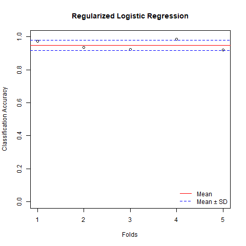
  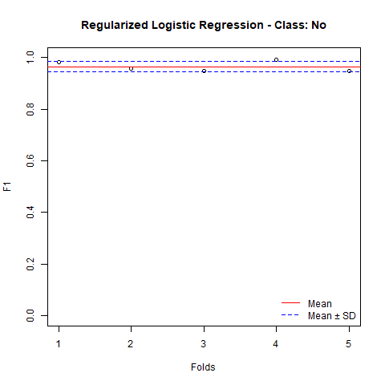
  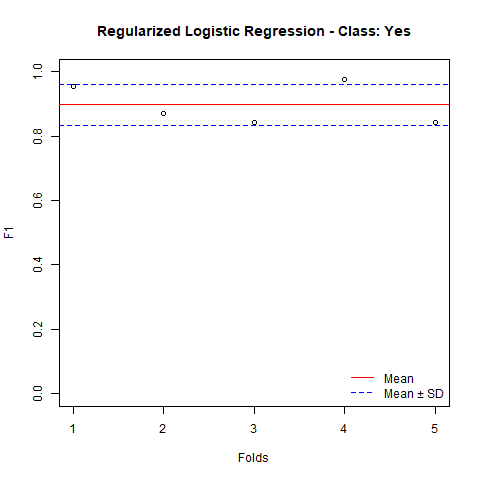
  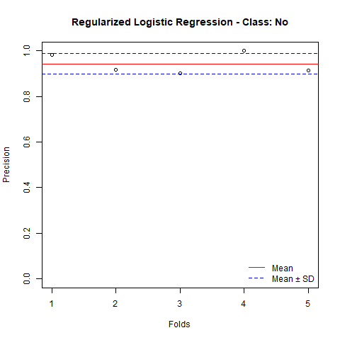
  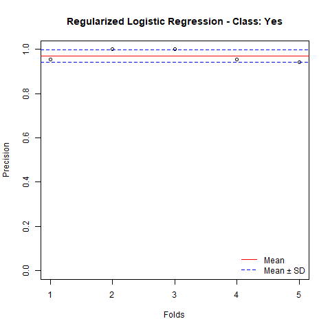
  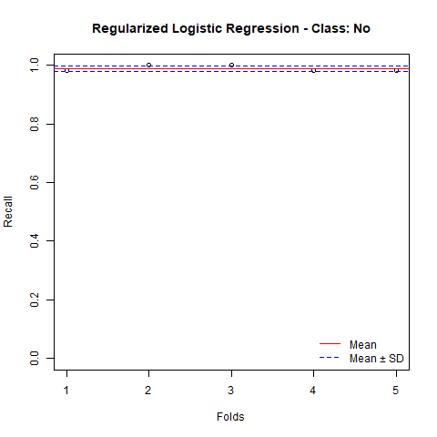
  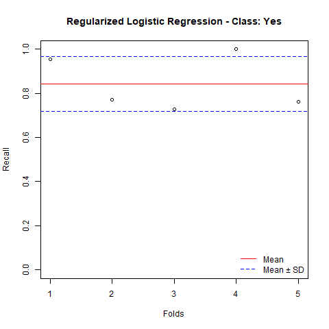
  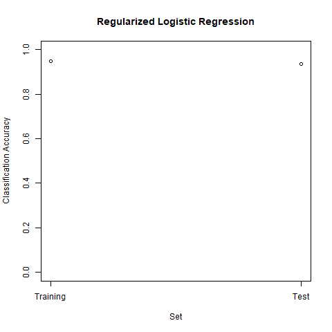
  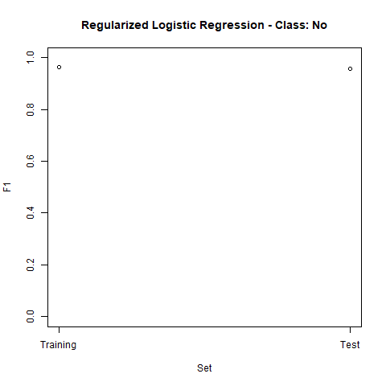
  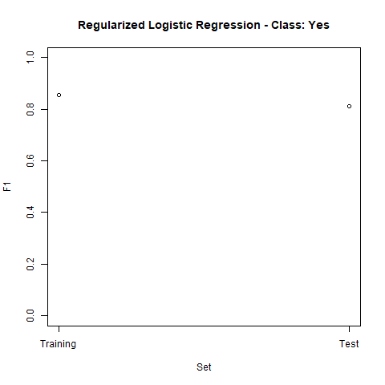
  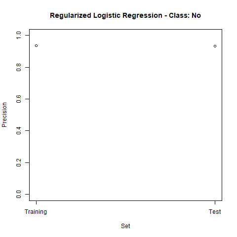
  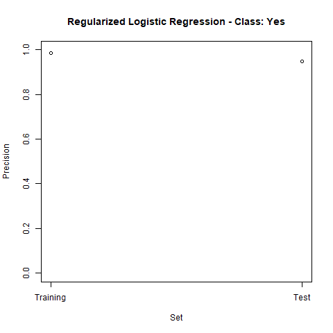
  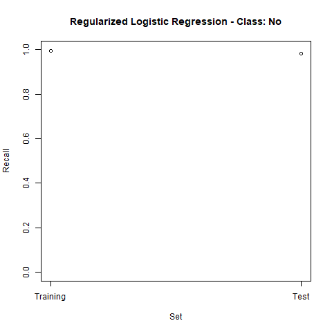
  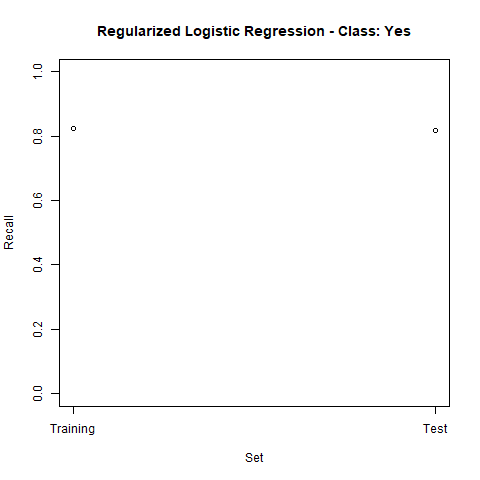

</details>


### Producing ROC and PR Curves with AUC scores
ROC and PR curves are only available for binary classification tasks. To generate either curve, the models must be
saved.

```R
# Can use `target` parameter, which accepts characters and integers instead of `formula`
results <- class_cv(
  data = thyroid_data,
  target = "Recurred", # Using 17, the column index of "Recurred" is also valid
  models = "naivebayes",
  train_params = list(
    split = 0.8,
    n_folds = 5,
    standardize = TRUE,
    stratified = TRUE,
    random_seed = 123
  ),
  save = list(models = TRUE)
)
```

Output consists of a `CurveResult` object containing thresholds used to generate the ROC, target labels, False Positive Rates (FPR), True Positive Rates (TPR)/Recall, Area Under The Curve (AUC), and Youden's Index for all training and validation sets for each model. For the PR curve, the outputs replace the FPR with Precision and Youden's Index with the maximum F1 score and its associated optimal threshold.

```R
# Will derive thresholds from the probabilities
roc_output <- results$roc_curve(
  data = thyroid_data,
  return_output = TRUE,
  thresholds = NULL,
  path = getwd()
)

pr_output <- results$pr_curve(
  data = thyroid_data,
  return_output = TRUE,
  thresholds = NULL,
  path = getwd()
)
```

**Output**

```
Warning message:
In .create_dictionary(x$classes, TRUE) :
  creating keys for target variable for `rocCurve`;
  classes are now encoded: No = 0, Yes = 1
  
Warning message:
In .create_dictionary(x$classes, TRUE) :
  creating keys for target variable for `prCurve`;
  classes are now encoded: No = 0, Yes = 1
```

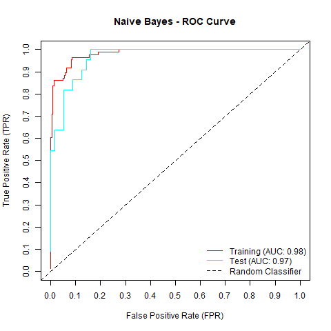
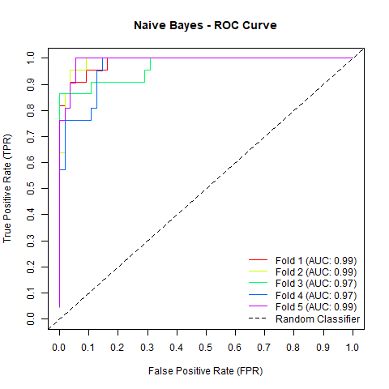
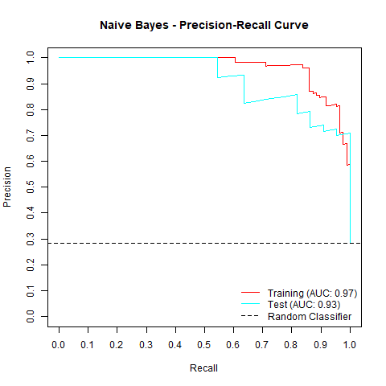
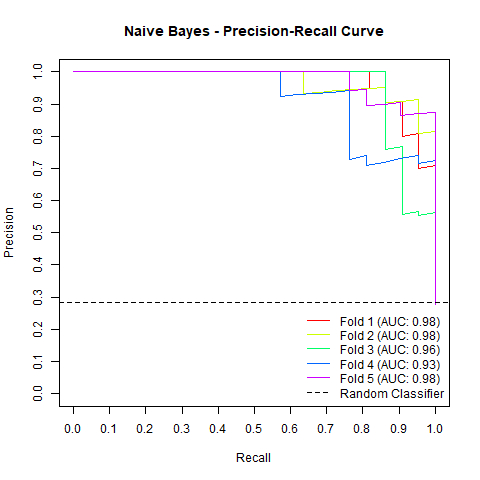


Access curve results using the `CurveResult` methods:

```R
# Get AUC for a specific model and partition
roc_output$get_auc("naivebayes", "split", "test")

# Get probabilities
roc_output$get_probs("naivebayes", "split", "train")

# Get curve metrics (FPR/TPR for ROC, precision/recall for PR)
roc_output$get_metrics("naivebayes", "split", "test")

# Get optimal threshold (Youden's Index for ROC, max F1 threshold for PR)
roc_output$get_optimal_threshold("naivebayes", "split", "test")

# Compare AUC across all models
roc_output$compare("split", "test")
```

<details>

<summary><strong>Output</strong></summary>

</details>

Optimal thresholds values can be used as input for `class_cv` to assess the performance when using a specific threshold.

```R
# Get average Youden's Index across folds
nb_results <- roc_output$get_model("naivebayes")
avg_youdens_indx <- mean(sapply(nb_results$cv, function(x) x$youdens_indx))

# Using 17, the column index of "Recurred"
results <- class_cv(
  data = thyroid_data,
  target = 17,
  models = "naivebayes",
  model_params = list(
    threshold = avg_youdens_indx
  ),
  train_params = list(
    n_folds = 5,
    standardize = TRUE,
    stratified = TRUE,
    random_seed = 123
  ),
  save = list(models = TRUE)
)

results$print()
```


<details>

<summary><strong>Output</strong></summary>

```
- - - - - - - - - - - - - - - - - - - - - - - - - - - - - - - - - - - - - - - - 


Model: Naive Bayes 

Formula: c(Recurred ~ Age + Gender + Smoking + Hx.Smoking + Hx.Radiothreapy + ,  Thyroid.Function + Physical.Examination + Adenopathy + Pathology + ,  Focality + Risk + T + N + M + Stage + Response)

Number of Features: 16

Classes: No, Yes

Training Parameters: list(split = NULL, n_folds = 5, stratified = TRUE, random_seed = 123, standardize = TRUE, remove_obs = FALSE)

Model Parameters: list(map_args = NULL, threshold = 0.446228154420309, final_model = FALSE)

Unlabeled Observations: 0

Incomplete Labeled Observations: 0

Observations Missing All Features: 0

Sample Size (Complete Observations): 383

Imputation Parameters: list(method = NULL, args = NULL)

Parallel Configs: list(n_cores = NULL, future.seed = NULL)


Cross-validation (CV) 
_ _ _ _ _ _ _ _ _ _ _ _ _ _ _ _ _ _ _ _ _ 

Average Classification Accuracy:  0.92 ± 0.03 (SD) 

Class:       Average Precision:        Average Recall:            Average F1:

No             0.95 ± 0.01 (SD)       0.93 ± 0.03 (SD)       0.94 ± 0.02 (SD) 
Yes            0.84 ± 0.07 (SD)       0.88 ± 0.03 (SD)       0.86 ± 0.04 (SD) 

- - - - - - - - - - - - - - - - - - - - - - - - - - - - - - - - - - - - - - - - 
```
</details>


### Impute Incomplete Labeled Data

Available options includes "impute_bag" and "impute_knn". Both methods use the recipe package for implementation.

```R
set.seed(0)

# Introduce some missing data
for (i in 1:ncol(thyroid_data)) {
  thyroid_data[sample(1:nrow(thyroid_data), size = round(nrow(thyroid_data) * .01)), i] <- NA
}

results <- class_cv(
  formula = Recurred ~ .,
  data = thyroid_data,
  models = "randomforest",
  train_params = list(
    split = 0.8,
    n_folds = 5,
    stratified = TRUE,
    random_seed = 123,
    standardize = TRUE
  ),
  impute_params = list(method = "impute_bag", args = list(trees = 20, seed_val = 123)),
  model_params = list(final_model = FALSE),
  save = list(models = FALSE, data = FALSE)
)
                   
results$print()
```


<details>

<summary><strong>Output</strong></summary>

```
Warning messages:
1: In .clean_data(data, missing_info, !is.null(impute_params$method)) :
  dropping 8 unlabeled observations
2: In .clean_data(data, missing_info, !is.null(impute_params$method)) :
  110 labeled observations are missing data in one or more features and will be imputed

- - - - - - - - - - - - - - - - - - - - - - - - - - - - - - - - - - - - - - - - 


Model: Random Forest 

Formula: Recurred ~ .

Number of Features: 16

Classes: No, Yes

Training Parameters: list(split = 0.8, n_folds = 5, stratified = TRUE, random_seed = 123, standardize = TRUE, remove_obs = FALSE)

Model Parameters: list(map_args = NULL, threshold = NULL, final_model = FALSE)

Unlabeled Observations: 8

Incomplete Labeled Observations: 110

Observations Missing All Features: 0

Sample Size (Complete + Imputed Incomplete Labeled Observations): 375

Imputation Parameters: list(method = "impute_bag", args = list(trees = 20, seed_val = 123))

Parallel Configs: list(n_cores = NULL, future.seed = NULL)


Training 
_ _ _ _ _ _ _ _ _ _ _ _ _ _ _ _ _ _ _ _ _ 

Classification Accuracy:  1.00 

Class:   Precision:  Recall:       F1:

No             1.00     1.00      1.00 
Yes            1.00     0.99      0.99 


Test 
_ _ _ _ _ _ _ _ _ _ _ _ _ _ _ _ _ _ _ _ _ 

Classification Accuracy:  0.96 

Class:   Precision:  Recall:       F1:

No             0.98     0.96      0.97 
Yes            0.91     0.95      0.93 


Cross-validation (CV) 
_ _ _ _ _ _ _ _ _ _ _ _ _ _ _ _ _ _ _ _ _ 

Average Classification Accuracy:  0.97 ± 0.01 (SD) 

Class:       Average Precision:        Average Recall:            Average F1:

No             0.97 ± 0.01 (SD)       0.98 ± 0.01 (SD)       0.98 ± 0.01 (SD) 
Yes            0.95 ± 0.03 (SD)       0.92 ± 0.03 (SD)       0.94 ± 0.01 (SD) 

- - - - - - - - - - - - - - - - - - - - - - - - - - - - - - - - - - - - - - - - 
```

</details>


### Using Parallel Processing

Parallel processing operates at the fold level, which means the system can simultaneously process multiple cross-validation folds (and the train-test split) even when training a single model.

*Note*: This example uses the [Internet Advertisements data from the UCI Machine Learning Repository](https://archive.ics.uci.edu/dataset/51/internet+advertisements).

```R
set.seed(NULL)

# Set url for Internet Advertisements data from UCI Machine Learning Repository. This data has 3,278 instances and 1558 features.
url <- "https://archive.ics.uci.edu/static/public/51/internet+advertisements.zip"

# Set file destination
dest_file <- file.path(getwd(), "ad.zip")

# Download zip file
download.file(url, dest_file)

# Unzip file
unzip(zipfile = dest_file, files = "ad.data")

# Read data
ad_data <- read.csv("ad.data")

# Load in vswift
library(vswift)

# Create arguments variable to tune parameters for multiple models
map_args <- list(
  "knn" = list(ks = 5),
  "xgboost" = list(
    params = list(
      booster = "gbtree",
      objective = "reg:logistic",
      lambda = 0.0003,
      alpha = 0.0003,
      eta = 0.8,
      max_depth = 6
    ),
    nrounds = 10
  )
)

print("Without Parallel Processing:")

# Obtain new start time
start <- proc.time()

# Run the same model without parallel processing
results <- class_cv(
  data = ad_data,
  target = "ad.",
  models = c("knn", "svm", "decisiontree", "xgboost"),
  train_params = list(
    split = 0.8,
    n_folds = 5,
    random_seed = 123
  ),
  model_params = list(map_args = map_args)
)

# Get end time
end <- proc.time() - start

# Print time
print(end)

print("Parallel Processing:")

# Adjust maximum object size that can be passed to workers during parallel processing; ~1.2 gb
options(future.globals.maxSize = 1200 * 1024^2)

# Obtain start time
start_par <- proc.time()

# Run model using parallel processing with 4 cores
results <- class_cv(
  data = ad_data,
  target = "ad.",
  models = c("knn", "svm", "decisiontree", "xgboost"),
  train_params = list(
    split = 0.8,
    n_folds = 5,
    random_seed = 123
  ),
  model_params = list(map_args = map_args),
  parallel_configs = list(
    n_cores = 6,
    future.seed = 100
  )
)

# Obtain end time
end_par <- proc.time() - start_par

# Print time
print(end_par)
```


<details>

<summary><strong>Output</strong></summary>

```
[1] "Without Parallel Processing:"

Warning message:
In .create_dictionary(preprocessed_data[, vars$target]) :
  creating keys for target variable due to 'logistic' or 'xgboost' being specified;
  classes are now encoded: ad. = 0, nonad. = 1

   user  system elapsed 
 231.08    3.50  217.13 

[1] "Parallel Processing:"

Warning message:
In .create_dictionary(preprocessed_data[, vars$target]) :
  creating keys for target variable due to 'logistic' or 'xgboost' being specified;
  classes are now encoded: ad. = 0, nonad. = 1

   user  system elapsed 
   2.06    5.89  103.59 
```
</details>

```R
# Print parameter information and model evaluation metrics; If number of features > 20, the target replaces the formula
results$print(models = c("xgboost", "knn"))
```
<details>

<summary><strong>Output</strong></summary>

```
- - - - - - - - - - - - - - - - - - - - - - - - - - - - - - - - - - - - - - - - - - 


Model: Extreme Gradient Boosting 

Target: ad.

Number of Features: 1558

Classes: ad., nonad.

Training Parameters: list(split = 0.8, n_folds = 5, stratified = FALSE, random_seed = 123, standardize = FALSE, remove_obs = FALSE)

Model Parameters: list(map_args = list(xgboost = list(params = list(booster = "gbtree", objective = "reg:logistic", lambda = 3e-04, alpha = 3e-04, eta = 0.8, max_depth = 6), nrounds = 10)), logistic_threshold = 0.5, final_model = FALSE)

Unlabeled Observations: 0

Incomplete Labeled Observations: 0

Observations Missing All Features: 0

Sample Size (Complete Data): 3278

Imputation Parameters: list(method = NULL, args = NULL)

Parallel Configs: list(n_cores = 6, future.seed = 100)


Training 
_ _ _ _ _ _ _ _ _ _ _ _ _ _ _ _ _ _ _ _ _ 

Classification Accuracy:  0.99 

Class:      Precision:  Recall:       F1:

ad.               0.98     0.93      0.96 
nonad.            0.99     1.00      0.99 


Test 
_ _ _ _ _ _ _ _ _ _ _ _ _ _ _ _ _ _ _ _ _ 

Classification Accuracy:  0.98 

Class:      Precision:  Recall:       F1:

ad.               0.99     0.85      0.91 
nonad.            0.97     1.00      0.99 


Cross-validation (CV) 
_ _ _ _ _ _ _ _ _ _ _ _ _ _ _ _ _ _ _ _ _ 

Average Classification Accuracy:  0.98 ± 0.01 (SD) 

Class:          Average Precision:        Average Recall:            Average F1:

ad.               0.95 ± 0.02 (SD)       0.88 ± 0.04 (SD)       0.91 ± 0.02 (SD) 
nonad.            0.98 ± 0.01 (SD)       0.99 ± 0.00 (SD)       0.99 ± 0.00 (SD) 

- - - - - - - - - - - - - - - - - - - - - - - - - - - - - - - - - - - - - - - - - - 


Model: K-Nearest Neighbors 

Target: ad.

Number of Features: 1558

Classes: ad., nonad.

Training Parameters: list(split = 0.8, n_folds = 5, stratified = FALSE, random_seed = 123, standardize = FALSE, remove_obs = FALSE)

Model Parameters: list(map_args = list(knn = list(ks = 5)), final_model = FALSE)

Unlabeled Observations: 0

Incomplete Labeled Observations: 0

Observations Missing All Features: 0

Sample Size (Complete Data): 3278

Imputation Parameters: list(method = NULL, args = NULL)

Parallel Configs: list(n_cores = 6, future.seed = 100)


Training 
_ _ _ _ _ _ _ _ _ _ _ _ _ _ _ _ _ _ _ _ _ 

Classification Accuracy:  0.99 

Class:      Precision:  Recall:       F1:

ad.               0.90     1.00      0.95 
nonad.            1.00     0.98      0.99 


Test 
_ _ _ _ _ _ _ _ _ _ _ _ _ _ _ _ _ _ _ _ _ 

Classification Accuracy:  0.91 

Class:      Precision:  Recall:       F1:

ad.               0.67     0.80      0.73 
nonad.            0.96     0.93      0.95 


Cross-validation (CV) 
_ _ _ _ _ _ _ _ _ _ _ _ _ _ _ _ _ _ _ _ _ 

Average Classification Accuracy:  0.93 ± 0.01 (SD) 

Class:          Average Precision:        Average Recall:            Average F1:

ad.               0.73 ± 0.06 (SD)       0.82 ± 0.05 (SD)       0.77 ± 0.03 (SD) 
nonad.            0.97 ± 0.01 (SD)       0.95 ± 0.01 (SD)       0.96 ± 0.01 (SD) 

- - - - - - - - - - - - - - - - - - - - - - - - - - - - - - - - - - - - - - - - - - 
```

</details>


```R
# Plot results
results$plot(
  models = "xgboost",
  class_names = "ad.",
  metrics = c("precision", "recall"),
  path = getwd()
)
```

<details>
  
  <summary><strong>Plots</strong></summary>

  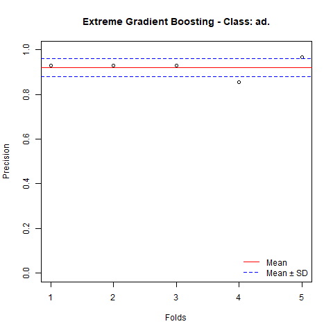
  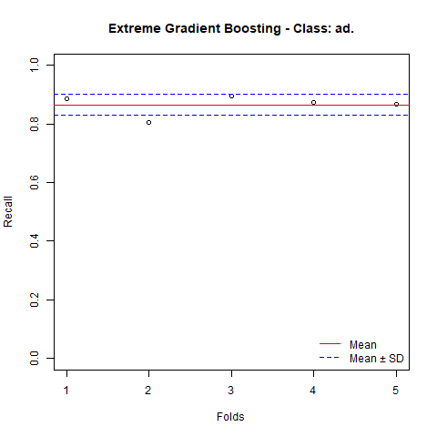
  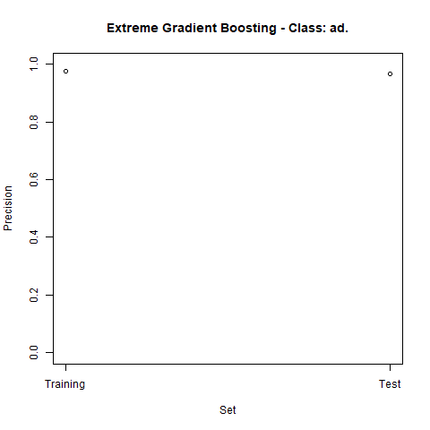
  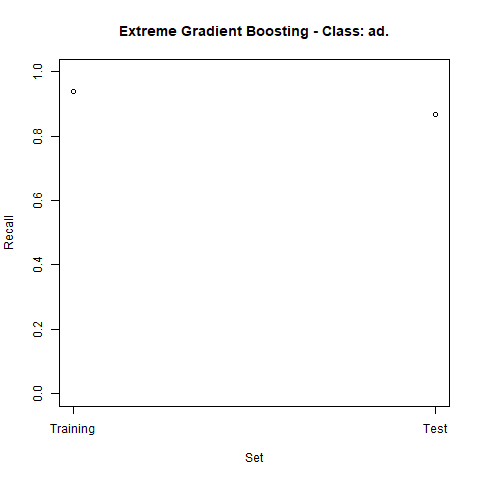

</details>


## Acknowledgements
The development of this package was inspired by other machine learning packages such as
topepo's [caret](https://github.com/topepo/caret) package, the
[scikit-learn](https://github.com/scikit-learn/scikit-learn) package, and the
[mlr3](https://github.com/mlr-org/mlr3) package.
